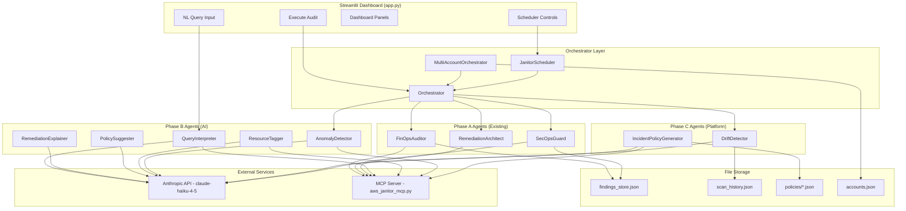
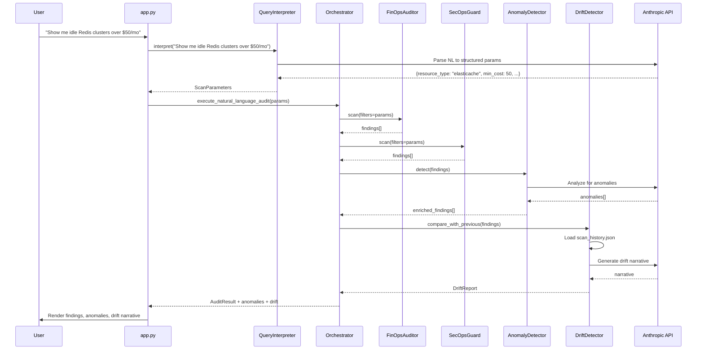
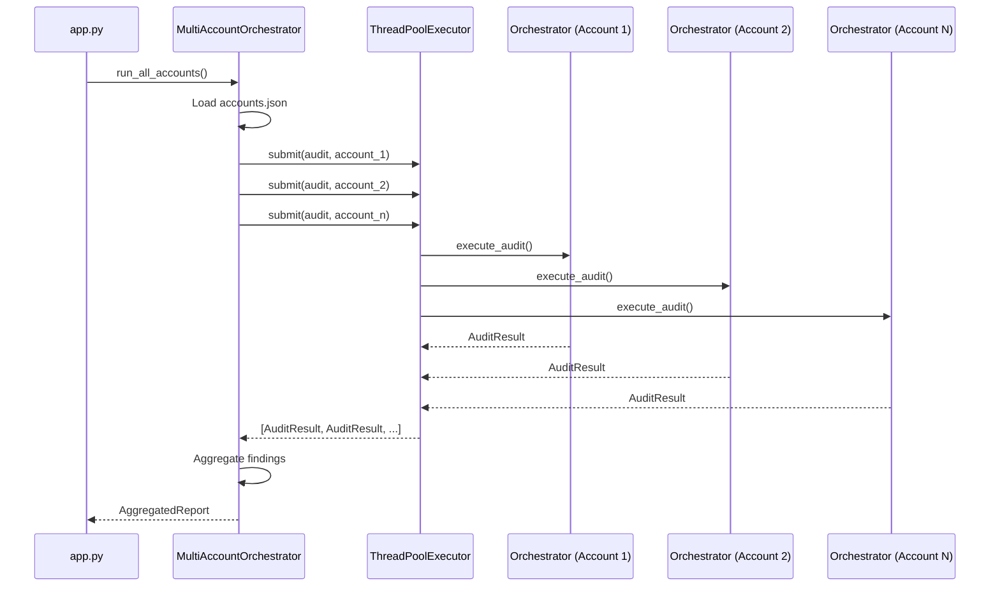
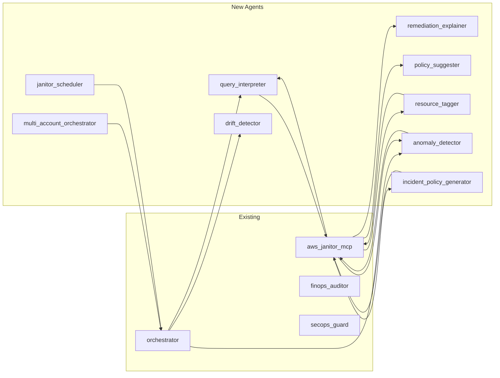

# Design Document: Cloud Janitor Phase B+C (AI & Platform Features)

## Overview

This design covers 9 features spanning Phase B (Tier 2 AI Features) and Phase C (Tier 3 Platform Features) for the Cloud Janitor project. Phase B introduces LLM-powered intelligence via Anthropic's claude-haiku-4-5 model — natural language querying, remediation explanations, policy suggestions, auto-tagging, and anomaly detection. Phase C adds platform capabilities — policy generation from incidents, drift detection with narrative, multi-account orchestration, and scheduled scans.

All AI agents follow the same architectural pattern: a dedicated class in `agents/`, a corresponding `@mcp.tool()` in `aws_janitor_mcp.py`, direct import (no network transport), safe-default error handling (never raise from AI), and session state caching in `app.py`. The existing pipeline (FinOps → SecOps → Remediation Architect) remains unchanged; new features integrate as pre-scan filters, post-scan enrichments, or independent workflows.

The implementation uses `JANITOR_BACKEND=fixture` compatibility throughout, ensuring all features work without live AWS credentials during development and testing.

## Architecture

### System Context



### Data Flow: NL Query → Scan → Anomaly → Drift → UI



### Multi-Account Concurrent Execution



### Scheduler Lifecycle

```mermaid
statediagram-v2
    [*] --> Idle
    Idle --> Running: start_scheduler()
    Running --> Executing: cron trigger
    Executing --> Running: audit complete
    Running --> Paused: pause_scheduler()
    Paused --> Running: resume_scheduler()
    Running --> Idle: stop_scheduler()
    Paused --> Idle: stop_scheduler()
```

## Components and Interfaces

### Component 1: QueryInterpreter (Phase B)

**Purpose**: Maps free-text natural language queries to structured scan parameters using claude-haiku-4-5.

**Interface**:

```python
class QueryInterpreter:
    def __init__(self, model: str = "claude-haiku-4-5"):
        ...

    def interpret(self, query: str) -> dict:
        """
        Parse NL query into structured scan parameters.

        Returns:
            {
                "resource_type": str | None,
                "min_idle_days": int,
                "min_cost": float,
                "severity_filter": list[str],
                "region_filter": str | None,
                "tags_filter": dict[str, str],
                "raw_query": str,
                "confidence": float
            }
        """
        ...
```

**Responsibilities**:

- Parse free-text into structured parameters via LLM
- Return safe defaults on LLM failure (empty filters = full scan)
- Validate parsed parameters against known resource types
- Cache results in session state

---

### Component 2: RemediationExplainer (Phase B)

**Purpose**: Generates plain-English explanations for remediation plans, describing what will happen and why.

**Interface**:

```python
class RemediationExplainer:
    def __init__(self, model: str = "claude-haiku-4-5"):
        ...

    def explain(self, plan: "RemediationPlan") -> dict:
        """
        Generate explanation for a remediation plan.

        Returns:
            {
                "summary": str,
                "what_happens": list[str],
                "risk_level": str,
                "rollback_description": str,
                "estimated_impact": str
            }
        """
        ...
```

**Responsibilities**:

- Summarize HCL changes in non-technical language
- Identify risk level and rollback path
- Never raise — return generic explanation on failure

---

### Component 3: PolicySuggester (Phase B)

**Purpose**: After a scan, suggests 3-5 additional policy checks the user might want to enable based on findings patterns.

**Interface**:

```python
class PolicySuggester:
    def __init__(self, model: str = "claude-haiku-4-5"):
        ...

    def suggest(self, findings: list[dict]) -> dict:
        """
        Suggest additional policies based on scan findings.

        Returns:
            {
                "suggestions": [
                    {
                        "policy_name": str,
                        "description": str,
                        "rationale": str,
                        "severity": str,
                        "check_type": str
                    }
                ],
                "based_on_patterns": list[str]
            }
        """
        ...
```

**Responsibilities**:

- Analyze finding patterns to suggest related checks
- Return 3-5 suggestions ranked by relevance
- Never raise — return empty suggestions on failure

---

### Component 4: ResourceTagger (Phase B)

**Purpose**: Infers environment/team/owner context from resource names, IDs, and metadata patterns.

**Interface**:

```python
class ResourceTagger:
    def __init__(self, model: str = "claude-haiku-4-5"):
        ...

    def infer_context(self, resource_id: str, metadata: dict) -> dict:
        """
        Infer tagging context for a single resource.

        Returns:
            {
                "resource_id": str,
                "inferred_tags": {
                    "environment": str,
                    "team": str,
                    "owner": str,
                    "service": str
                },
                "confidence": float,
                "reasoning": str
            }
        """
        ...

    def infer_batch(self, resources: list[dict]) -> list[dict]:
        """Batch inference for multiple resources."""
        ...
```

**Responsibilities**:

- Parse resource naming conventions (prod-, staging-, dev- prefixes)
- Infer team/owner from tag patterns and naming
- Support batch inference for efficiency
- Never raise — return empty tags with low confidence on failure

---

### Component 5: AnomalyDetector (Phase B)

**Purpose**: Flags suspicious resources not caught by rule-based checks. Integrates post-scan in orchestrator.

**Interface**:

```python
class AnomalyDetector:
    def __init__(self, model: str = "claude-haiku-4-5"):
        ...

    def detect(self, findings: list[dict], all_resources: list[dict]) -> dict:
        """
        Detect anomalies beyond rule-based findings.

        Returns:
            {
                "anomalies": [
                    {
                        "resource_id": str,
                        "anomaly_type": str,
                        "description": str,
                        "severity": str,
                        "confidence": float,
                        "recommendation": str
                    }
                ],
                "analysis_summary": str
            }
        """
        ...
```

**Responsibilities**:

- Compare resources against expected patterns
- Identify cost spikes, unusual configurations, orphaned resources
- Integrated into orchestrator post-scan pipeline
- Never raise — return empty anomalies on failure

---

### Component 6: IncidentPolicyGenerator (Phase C)

**Purpose**: Generates preventive scan policies from incident descriptions. Saves as JSON in `policies/` directory.

**Interface**:

```python
class IncidentPolicyGenerator:
    def __init__(self, model: str = "claude-haiku-4-5", policies_dir: Path = None):
        ...

    def generate_policy(self, incident_description: str) -> dict:
        """
        Generate a preventive scan policy from an incident.

        Returns:
            {
                "policy_id": str,
                "policy_name": str,
                "description": str,
                "check_type": str,
                "resource_types": list[str],
                "conditions": list[dict],
                "severity": str,
                "created_from_incident": str,
                "created_at": str
            }
        """
        ...

    def list_policies(self) -> list[dict]:
        """List all saved policies from policies/ directory."""
        ...
```

**Responsibilities**:

- Parse incident descriptions to identify preventive checks
- Generate structured policy JSON
- Save policies to `policies/` directory with unique filenames
- Never raise — return error dict on failure

---

### Component 7: DriftDetector (Phase C)

**Purpose**: Compares scan snapshots over time and generates LLM narrative explaining what changed. Uses atomic writes with filelock.

**Interface**:

```python
class DriftDetector:
    def __init__(
        self,
        model: str = "claude-haiku-4-5",
        history_path: Path = None,
    ):
        ...

    def record_snapshot(self, findings: list[dict], scan_id: str) -> None:
        """Record current scan to scan_history.json with atomic write + filelock."""
        ...

    def detect_drift(self, current_findings: list[dict]) -> dict:
        """
        Compare current scan against previous snapshot.

        Returns:
            {
                "has_drift": bool,
                "new_findings": list[dict],
                "resolved_findings": list[dict],
                "changed_severity": list[dict],
                "narrative": str,
                "previous_scan_id": str | None,
                "current_scan_id": str
            }
        """
        ...
```

**Responsibilities**:

- Maintain `scan_history.json` with atomic writes (filelock)
- Compare consecutive scans for new/resolved/changed findings
- Generate LLM narrative explaining drift
- Integrated into orchestrator post-scan
- Never raise — return no-drift report on failure

---

### Component 8: MultiAccountOrchestrator (Phase C)

**Purpose**: Runs concurrent audits across multiple AWS accounts defined in `accounts.json`. Uses ThreadPoolExecutor.

**Interface**:

```python
class MultiAccountOrchestrator:
    def __init__(
        self,
        accounts_path: Path = None,
        max_workers: int = 4,
    ):
        ...

    def run_all_accounts(self) -> dict:
        """
        Execute audits across all configured accounts concurrently.

        Returns:
            {
                "accounts_audited": int,
                "total_findings": int,
                "results_by_account": {
                    "<account_id>": {
                        "account_name": str,
                        "success": bool,
                        "findings_count": int,
                        "findings": list[dict],
                        "error": str | None
                    }
                },
                "aggregated_summary": {
                    "by_severity": dict,
                    "by_agent": dict,
                    "total_monthly_waste": float
                }
            }
        """
        ...

    def load_accounts(self) -> list[dict]:
        """Load accounts from accounts.json."""
        ...
```

**Responsibilities**:

- Load account configurations from `accounts.json`
- Run concurrent audits via ThreadPoolExecutor
- Aggregate findings across accounts
- Isolate failures per account (one failure doesn't stop others)
- Never raise from individual account audits

---

### Component 9: JanitorScheduler (Phase C)

**Purpose**: Provides cron-based automated scans using APScheduler. Manages scheduler lifecycle.

**Interface**:

```python
class JanitorScheduler:
    def __init__(
        self,
        orchestrator: "Orchestrator" = None,
        timezone: str = "UTC",
    ):
        ...

    def start(self, cron_expression: str = "0 2 * * *") -> dict:
        """
        Start the scheduler with given cron expression.

        Returns:
            {"status": "started", "cron": str, "next_run": str}
        """
        ...

    def stop(self) -> dict:
        """Stop the scheduler. Returns {"status": "stopped"}."""
        ...

    def pause(self) -> dict:
        """Pause without destroying. Returns {"status": "paused"}."""
        ...

    def resume(self) -> dict:
        """Resume from paused state. Returns {"status": "running", "next_run": str}."""
        ...

    def get_status(self) -> dict:
        """
        Returns:
            {
                "status": str,  # "idle" | "running" | "paused"
                "cron_expression": str | None,
                "next_run": str | None,
                "last_run": str | None,
                "total_runs": int
            }
        """
        ...

    def get_history(self) -> list[dict]:
        """Return list of past scheduled run results."""
        ...
```

**Responsibilities**:

- Manage APScheduler BackgroundScheduler lifecycle
- Support cron expressions for flexible scheduling
- Track run history and status
- Graceful shutdown on application exit
- Thread-safe state management

## Data Models

### ScanParameters (QueryInterpreter output)

```python
@dataclass
class ScanParameters:
    resource_type: str | None = None
    min_idle_days: int = 0
    min_cost: float = 0.0
    severity_filter: list[str] = field(default_factory=list)
    region_filter: str | None = None
    tags_filter: dict[str, str] = field(default_factory=dict)
    raw_query: str = ""
    confidence: float = 0.0
```

**Validation Rules**:

- `resource_type` must be in {"elasticache", "ebs", "ec2", "security_group"} or None
- `min_idle_days` >= 0
- `min_cost` >= 0.0
- `severity_filter` items must be in {"LOW", "MEDIUM", "HIGH", "CRITICAL"}
- `confidence` in [0.0, 1.0]

### AccountConfig (Multi-Account)

```python
@dataclass
class AccountConfig:
    account_id: str
    account_name: str
    role_arn: str
    regions: list[str] = field(default_factory=lambda: ["us-east-1"])
    enabled: bool = True
```

**Validation Rules**:

- `account_id` must be 12-digit string
- `role_arn` must match `arn:aws:iam::\d{12}:role/.+`
- `regions` must contain valid AWS region codes

### DriftSnapshot (Drift Detection)

```python
@dataclass
class DriftSnapshot:
    scan_id: str
    timestamp: str
    findings_hash: str
    findings_count: int
    findings_by_severity: dict[str, int]
    findings_ids: list[str]
```

### Policy (Incident Policy Generator)

```python
@dataclass
class Policy:
    policy_id: str
    policy_name: str
    description: str
    check_type: str
    resource_types: list[str]
    conditions: list[dict]
    severity: str
    created_from_incident: str
    created_at: str
```

**Validation Rules**:

- `policy_id` must be UUID format
- `check_type` in {"cost", "security", "compliance", "performance"}
- `severity` in {"LOW", "MEDIUM", "HIGH", "CRITICAL"}
- `conditions` must have at least one entry

## Algorithmic Pseudocode

### Algorithm 1: Natural Language Query Interpretation

```python
def interpret_query(query: str, model: str = "claude-haiku-4-5") -> dict:
    """Map free-text to structured scan parameters via LLM."""
    ...
```

**Preconditions:**

- `query` is non-empty string
- Anthropic API key is available in environment
- `model` is a valid Anthropic model identifier

**Postconditions:**

- Returns dict with all ScanParameters fields
- On LLM failure: returns safe defaults (empty filters = full scan)
- `confidence` field reflects LLM's certainty in parsing
- Never raises an exception

**Algorithm:**

```python
ALGORITHM interpret_query(query)
INPUT: query: str — natural language scan request
OUTPUT: ScanParameters dict

BEGIN
    ASSERT query != ""

    prompt = f"""Parse this cloud resource query into structured parameters.
    Query: {query}
    
    Return JSON with: resource_type, min_idle_days, min_cost,
    severity_filter, region_filter, tags_filter, confidence.
    
    Valid resource_types: elasticache, ebs, ec2, security_group, null
    Valid severities: LOW, MEDIUM, HIGH, CRITICAL
    """

    TRY:
        response = anthropic_client.messages.create(
            model=model,
            max_tokens=512,
            messages=[{"role": "user", "content": prompt}]
        )
        parsed = json.loads(response.content[0].text)
        
        # Validate and sanitize
        params = {
            "resource_type": parsed.get("resource_type") if parsed.get("resource_type") in VALID_TYPES else None,
            "min_idle_days": max(0, int(parsed.get("min_idle_days", 0))),
            "min_cost": max(0.0, float(parsed.get("min_cost", 0.0))),
            "severity_filter": [s for s in parsed.get("severity_filter", []) if s in VALID_SEVERITIES],
            "region_filter": parsed.get("region_filter"),
            "tags_filter": parsed.get("tags_filter", {}),
            "raw_query": query,
            "confidence": min(1.0, max(0.0, float(parsed.get("confidence", 0.5))))
        }
        RETURN params
    EXCEPT Exception:
        RETURN default_scan_parameters(raw_query=query)
END
```

### Algorithm 2: Anomaly Detection (Post-Scan)

```python
def detect_anomalies(findings: list[dict], all_resources: list[dict]) -> dict:
    """Flag suspicious resources not caught by rules."""
    ...
```

**Preconditions:**

- `findings` is a valid list of Finding dicts (may be empty)
- `all_resources` contains raw resource data from MCP
- Anthropic API available

**Postconditions:**

- Returns dict with `anomalies` list and `analysis_summary`
- Each anomaly has resource_id, type, description, severity, confidence, recommendation
- Never raises — returns empty anomalies on any failure
- Anomalies are distinct from existing findings (no duplicates)

**Algorithm:**

```python
ALGORITHM detect_anomalies(findings, all_resources)
INPUT: findings: list[dict], all_resources: list[dict]
OUTPUT: AnomalyReport dict

BEGIN
    already_flagged_ids = {f["resource_id"] for f in findings}
    unflagged_resources = [r for r in all_resources if r["id"] not in already_flagged_ids]

    IF len(unflagged_resources) == 0:
        RETURN {"anomalies": [], "analysis_summary": "No unflagged resources to analyze."}

    prompt = f"""Analyze these AWS resources for anomalies.
    Already flagged: {len(findings)} resources.
    Unflagged resources to analyze: {json.dumps(unflagged_resources[:50])}
    
    Look for: cost spikes, unusual configs, orphaned resources,
    resources that SHOULD be flagged but weren't caught by rules.
    
    Return JSON array of anomalies with: resource_id, anomaly_type,
    description, severity, confidence, recommendation.
    """

    TRY:
        response = call_llm(prompt)
        anomalies = json.loads(response)
        
        # Filter: only keep anomalies for resources not already flagged
        valid_anomalies = [a for a in anomalies if a["resource_id"] not in already_flagged_ids]
        
        RETURN {
            "anomalies": valid_anomalies,
            "analysis_summary": f"Found {len(valid_anomalies)} anomaly(ies) in {len(unflagged_resources)} unflagged resources."
        }
    EXCEPT Exception:
        RETURN {"anomalies": [], "analysis_summary": "Anomaly detection unavailable."}
END
```

### Algorithm 3: Drift Detection with Atomic Write

```python
def detect_drift(current_findings: list[dict], history_path: Path) -> dict:
    """Compare current scan against previous and generate narrative."""
    ...
```

**Preconditions:**

- `current_findings` is a valid list of Finding dicts
- `history_path` points to scan_history.json location (may not exist yet)
- filelock library available

**Postconditions:**

- scan_history.json is updated atomically (no partial writes)
- Returns DriftReport with new/resolved/changed findings
- `narrative` field contains LLM-generated explanation (or empty string on failure)
- File lock is always released (even on error)
- Never raises

**Algorithm:**

```python
ALGORITHM detect_drift(current_findings, history_path)
INPUT: current_findings: list[dict], history_path: Path
OUTPUT: DriftReport dict

BEGIN
    current_ids = {f["id"] for f in current_findings}
    current_by_id = {f["resource_id"]: f for f in current_findings}
    scan_id = generate_uuid()

    # Atomic read of previous snapshot
    lock = FileLock(str(history_path) + ".lock", timeout=10)
    TRY:
        WITH lock:
            IF history_path.exists():
                history = json.loads(history_path.read_text())
                previous = history.get("snapshots", [])[-1] IF history.get("snapshots") ELSE None
            ELSE:
                previous = None
                history = {"snapshots": []}
    EXCEPT Timeout:
        RETURN no_drift_report(scan_id)

    IF previous IS None:
        # First scan — record and return no drift
        record_snapshot(current_findings, scan_id, history, history_path, lock)
        RETURN {"has_drift": False, "new_findings": [], "resolved_findings": [],
                "changed_severity": [], "narrative": "First scan recorded.",
                "previous_scan_id": None, "current_scan_id": scan_id}

    # Compare
    prev_resource_ids = set(previous.get("findings_ids", []))
    curr_resource_ids = {f["resource_id"] for f in current_findings}

    new_findings = [f for f in current_findings if f["resource_id"] not in prev_resource_ids]
    resolved_ids = prev_resource_ids - curr_resource_ids

    # Detect severity changes
    changed_severity = []
    prev_severities = previous.get("severities_by_resource", {})
    FOR f IN current_findings:
        IF f["resource_id"] IN prev_severities:
            IF f["severity"] != prev_severities[f["resource_id"]]:
                changed_severity.append({
                    "resource_id": f["resource_id"],
                    "old_severity": prev_severities[f["resource_id"]],
                    "new_severity": f["severity"]
                })

    has_drift = len(new_findings) > 0 OR len(resolved_ids) > 0 OR len(changed_severity) > 0

    # Generate narrative via LLM
    narrative = generate_drift_narrative(new_findings, resolved_ids, changed_severity)

    # Record current snapshot atomically
    record_snapshot(current_findings, scan_id, history, history_path, lock)

    RETURN {
        "has_drift": has_drift,
        "new_findings": new_findings,
        "resolved_findings": list(resolved_ids),
        "changed_severity": changed_severity,
        "narrative": narrative,
        "previous_scan_id": previous.get("scan_id"),
        "current_scan_id": scan_id
    }
END
```

**Loop Invariants:** N/A (no loops in main algorithm)

### Algorithm 4: Multi-Account Concurrent Execution

```python
def run_all_accounts(accounts_path: Path, max_workers: int) -> dict:
    """Execute audits concurrently across accounts."""
    ...
```

**Preconditions:**

- `accounts_path` points to valid accounts.json
- `max_workers` > 0
- Each account in accounts.json has required fields

**Postconditions:**

- All enabled accounts are audited (or error recorded)
- Single account failure does not block others
- Results aggregated across all accounts
- Thread safety maintained via isolated Orchestrator instances

**Algorithm:**

```python
ALGORITHM run_all_accounts(accounts_path, max_workers)
INPUT: accounts_path: Path, max_workers: int
OUTPUT: AggregatedReport dict

BEGIN
    accounts = load_accounts(accounts_path)
    enabled_accounts = [a for a in accounts if a.get("enabled", True)]

    results_by_account = {}

    WITH ThreadPoolExecutor(max_workers=max_workers) AS executor:
        futures = {}
        FOR account IN enabled_accounts:
            future = executor.submit(audit_single_account, account)
            futures[future] = account

        FOR future IN as_completed(futures):
            account = futures[future]
            account_id = account["account_id"]
            TRY:
                result = future.result(timeout=300)
                results_by_account[account_id] = {
                    "account_name": account["account_name"],
                    "success": True,
                    "findings_count": len(result.findings),
                    "findings": result.findings,
                    "error": None
                }
            EXCEPT Exception AS e:
                results_by_account[account_id] = {
                    "account_name": account["account_name"],
                    "success": False,
                    "findings_count": 0,
                    "findings": [],
                    "error": str(e)
                }

    # Aggregate
    all_findings = []
    FOR acct_result IN results_by_account.values():
        all_findings.extend(acct_result["findings"])

    RETURN {
        "accounts_audited": len(enabled_accounts),
        "total_findings": len(all_findings),
        "results_by_account": results_by_account,
        "aggregated_summary": compute_summary(all_findings)
    }
END
```

**Loop Invariants:**

- For the futures loop: all completed futures have been processed
- results_by_account grows monotonically (one entry per completed future)

### Algorithm 5: Scheduled Scans (APScheduler)

```python
def start_scheduler(cron_expression: str, orchestrator: "Orchestrator") -> dict:
    """Start cron-based automated scans."""
    ...
```

**Preconditions:**

- `cron_expression` is valid cron syntax (5-field)
- `orchestrator` is a configured Orchestrator instance
- APScheduler library available

**Postconditions:**

- BackgroundScheduler is running with configured trigger
- `get_status()` returns "running"
- Scheduler shuts down cleanly on application exit
- Multiple `start()` calls are idempotent (stops previous, starts new)

**Algorithm:**

```python
ALGORITHM start_scheduler(cron_expression, orchestrator)
INPUT: cron_expression: str, orchestrator: Orchestrator
OUTPUT: status dict

BEGIN
    IF self._scheduler IS NOT None AND self._scheduler.running:
        self._scheduler.shutdown(wait=False)

    self._scheduler = BackgroundScheduler(timezone=self._timezone)

    # Parse cron fields
    fields = parse_cron(cron_expression)  # minute, hour, day, month, day_of_week

    self._scheduler.add_job(
        func=self._execute_scheduled_audit,
        trigger=CronTrigger(**fields),
        id="janitor_audit",
        replace_existing=True,
    )

    self._scheduler.start()
    self._cron_expression = cron_expression
    self._status = "running"

    next_run = self._scheduler.get_job("janitor_audit").next_run_time

    RETURN {"status": "started", "cron": cron_expression, "next_run": next_run.isoformat()}
END

ALGORITHM _execute_scheduled_audit(self)
INPUT: None (uses self._orchestrator)
OUTPUT: None (records in history)

BEGIN
    run_record = {"started_at": now_iso(), "status": "running"}
    TRY:
        result = self._orchestrator.execute_audit()
        run_record["status"] = "success" IF result.success ELSE "failure"
        run_record["findings_count"] = len(result.findings)
        run_record["error"] = result.error
    EXCEPT Exception AS e:
        run_record["status"] = "error"
        run_record["error"] = str(e)
    FINALLY:
        run_record["completed_at"] = now_iso()
        self._history.append(run_record)
        self._total_runs += 1
END
```

### Algorithm 6: Policy From Incident

```python
def generate_policy(incident_description: str) -> dict:
    """Generate preventive policy from incident description."""
    ...
```

**Preconditions:**

- `incident_description` is non-empty string
- Anthropic API available
- `policies/` directory exists or can be created

**Postconditions:**

- Returns valid Policy dict
- Policy JSON file written to `policies/<policy_id>.json`
- On LLM failure: returns error dict, no file written
- Policy conditions are actionable (can be evaluated against resources)

**Algorithm:**

```python
ALGORITHM generate_policy(incident_description)
INPUT: incident_description: str
OUTPUT: Policy dict

BEGIN
    ASSERT incident_description != ""

    prompt = f"""Given this infrastructure incident, generate a preventive
    scan policy that would catch this issue before it happens.

    Incident: {incident_description}

    Return JSON with: policy_name, description, check_type,
    resource_types, conditions (list of {field, operator, value}),
    severity.
    
    check_type must be one of: cost, security, compliance, performance
    severity must be one of: LOW, MEDIUM, HIGH, CRITICAL
    """

    TRY:
        response = call_llm(prompt)
        parsed = json.loads(response)

        policy = {
            "policy_id": str(uuid4()),
            "policy_name": parsed["policy_name"],
            "description": parsed["description"],
            "check_type": parsed["check_type"],
            "resource_types": parsed["resource_types"],
            "conditions": parsed["conditions"],
            "severity": parsed["severity"],
            "created_from_incident": incident_description[:200],
            "created_at": now_iso()
        }

        # Write to policies directory
        policies_dir.mkdir(parents=True, exist_ok=True)
        policy_path = policies_dir / f"{policy['policy_id']}.json"
        policy_path.write_text(json.dumps(policy, indent=2))

        RETURN policy
    EXCEPT Exception AS e:
        RETURN {"error": str(e), "policy_id": None}
END
```

## Key Functions with Formal Specifications

### MCP Tool: interpret_query

```python
@mcp.tool()
def interpret_query(query: str) -> dict:
    """Parse natural language query into scan parameters."""
    interpreter = QueryInterpreter()
    return interpreter.interpret(query)
```

**Preconditions:**

- `query` is a non-empty string

**Postconditions:**

- Returns dict with keys: resource_type, min_idle_days, min_cost, severity_filter, region_filter, tags_filter, raw_query, confidence
- All numeric values are non-negative
- confidence in [0.0, 1.0]
- Never raises

---

### MCP Tool: explain_remediation

```python
@mcp.tool()
def explain_remediation(plan_json: str) -> dict:
    """Generate plain-English explanation of a remediation plan."""
    explainer = RemediationExplainer()
    plan = json.loads(plan_json)
    return explainer.explain(plan)
```

**Preconditions:**

- `plan_json` is valid JSON representing a RemediationPlan

**Postconditions:**

- Returns dict with keys: summary, what_happens, risk_level, rollback_description, estimated_impact
- `what_happens` is a non-empty list of strings
- `risk_level` in {"low", "medium", "high"}
- Never raises

---

### MCP Tool: suggest_policies

```python
@mcp.tool()
def suggest_policies(findings_json: str) -> dict:
    """Suggest additional policy checks based on findings."""
    suggester = PolicySuggester()
    findings = json.loads(findings_json)
    return suggester.suggest(findings)
```

**Preconditions:**

- `findings_json` is valid JSON array of Finding dicts

**Postconditions:**

- Returns dict with keys: suggestions, based_on_patterns
- `suggestions` has 0-5 entries
- Each suggestion has: policy_name, description, rationale, severity, check_type
- Never raises

---

### MCP Tool: infer_resource_context

```python
@mcp.tool()
def infer_resource_context(resource_id: str, metadata_json: str = "{}") -> dict:
    """Infer environment/team/owner tags for a resource."""
    tagger = ResourceTagger()
    metadata = json.loads(metadata_json)
    return tagger.infer_context(resource_id, metadata)
```

**Preconditions:**

- `resource_id` is non-empty string
- `metadata_json` is valid JSON (may be empty object)

**Postconditions:**

- Returns dict with keys: resource_id, inferred_tags, confidence, reasoning
- `inferred_tags` has keys: environment, team, owner, service (any may be "unknown")
- `confidence` in [0.0, 1.0]
- Never raises

---

### MCP Tool: detect_anomalies

```python
@mcp.tool()
def detect_anomalies(findings_json: str, resources_json: str) -> dict:
    """Detect anomalies not caught by rule-based checks."""
    detector = AnomalyDetector()
    findings = json.loads(findings_json)
    resources = json.loads(resources_json)
    return detector.detect(findings, resources)
```

**Preconditions:**

- `findings_json` is valid JSON array
- `resources_json` is valid JSON array

**Postconditions:**

- Returns dict with keys: anomalies, analysis_summary
- Anomaly resource_ids are disjoint from finding resource_ids
- Never raises

---

### MCP Tool: policy_from_incident

```python
@mcp.tool()
def policy_from_incident(incident_description: str) -> dict:
    """Generate preventive scan policy from an incident."""
    generator = IncidentPolicyGenerator()
    return generator.generate_policy(incident_description)
```

**Preconditions:**

- `incident_description` is non-empty string

**Postconditions:**

- On success: returns Policy dict, file written to policies/
- On failure: returns {"error": str, "policy_id": None}
- Never raises

---

### MCP Tool: aggregate_findings

```python
@mcp.tool()
def aggregate_findings(accounts_json: str = None) -> dict:
    """Run multi-account audit and aggregate results."""
    orchestrator = MultiAccountOrchestrator()
    return orchestrator.run_all_accounts()
```

**Preconditions:**

- accounts.json exists and contains valid account configs

**Postconditions:**

- Returns dict with: accounts_audited, total_findings, results_by_account, aggregated_summary
- Individual account failures isolated
- Never raises

---

### Orchestrator: execute_natural_language_audit

```python
def execute_natural_language_audit(self, query: str) -> AuditResult:
    """Execute audit pipeline filtered by NL query parameters."""
    ...
```

**Preconditions:**

- `query` is non-empty string
- Orchestrator is properly initialized

**Postconditions:**

- Interprets query, applies filters, runs pipeline
- Returns AuditResult (same schema as execute_audit)
- On interpretation failure: falls back to full unfiltered scan
- Anomaly detection and drift detection run post-scan

## Example Usage

```python
# Example 1: Natural Language Query
from agents.query_interpreter import QueryInterpreter

interpreter = QueryInterpreter()
params = interpreter.interpret("Show me idle Redis clusters costing over $50/month")
# params = {
#     "resource_type": "elasticache",
#     "min_idle_days": 30,
#     "min_cost": 50.0,
#     "severity_filter": [],
#     "region_filter": None,
#     "tags_filter": {},
#     "raw_query": "Show me idle Redis clusters costing over $50/month",
#     "confidence": 0.92
# }

# Example 2: Remediation Explanation
from agents.remediation_explainer import RemediationExplainer

explainer = RemediationExplainer()
explanation = explainer.explain(remediation_plan)
# explanation = {
#     "summary": "This will restrict SSH access on sg-abc123 to VPC-only traffic.",
#     "what_happens": [
#         "The security group rule allowing SSH from 0.0.0.0/0 will be removed",
#         "A new rule will be created allowing SSH only from VPC CIDR"
#     ],
#     "risk_level": "low",
#     "rollback_description": "Rollback restores the original 0.0.0.0/0 SSH rule.",
#     "estimated_impact": "External SSH access will be blocked."
# }

# Example 3: Multi-Account Execution
from agents.multi_account_orchestrator import MultiAccountOrchestrator

mao = MultiAccountOrchestrator(max_workers=4)
report = mao.run_all_accounts()
# report["accounts_audited"] == 3
# report["total_findings"] == 12

# Example 4: Scheduled Scan
from agents.janitor_scheduler import JanitorScheduler
from orchestrator import Orchestrator

scheduler = JanitorScheduler(orchestrator=Orchestrator())
status = scheduler.start("0 2 * * *")  # 2 AM daily
# status = {"status": "started", "cron": "0 2 * * *", "next_run": "2025-01-16T02:00:00Z"}

# Example 5: Drift Detection
from agents.drift_detector import DriftDetector

detector = DriftDetector()
drift = detector.detect_drift(current_findings)
# drift = {
#     "has_drift": True,
#     "new_findings": [{"resource_id": "vol-new123", ...}],
#     "resolved_findings": ["vol-old456"],
#     "changed_severity": [{"resource_id": "sg-abc", "old_severity": "HIGH", "new_severity": "CRITICAL"}],
#     "narrative": "Since the last scan, 1 new unattached EBS volume was found...",
#     ...
# }

# Example 6: Policy from Incident
from agents.incident_policy_generator import IncidentPolicyGenerator

gen = IncidentPolicyGenerator()
policy = gen.generate_policy(
    "Production outage caused by unencrypted ElastiCache cluster in public subnet"
)
# policy = {
#     "policy_id": "abc-123",
#     "policy_name": "elasticache-encryption-public-subnet",
#     "check_type": "security",
#     "conditions": [{"field": "encryption_at_rest", "operator": "equals", "value": False}],
#     ...
# }
```

## Correctness Properties

### Property 1: Universal Properties (All AI Agents)

1. **Never-Raise**: ∀ input, ∀ agent ∈ {QueryInterpreter, RemediationExplainer, PolicySuggester, ResourceTagger, AnomalyDetector, IncidentPolicyGenerator, DriftDetector}: agent.method(input) does not raise an exception
2. **Safe Defaults**: ∀ agent, if LLM call fails → output contains valid default values (empty lists, zero counts, "unknown" strings)
3. **Schema Compliance**: ∀ agent output: all required keys present with correct types
4. **Idempotency of Read Operations**: ∀ read-only methods (interpret, explain, suggest, detect): calling twice with same input produces structurally equivalent output

### Property 2: QueryInterpreter Properties

1. **Confidence Bounded**: ∀ query: 0.0 ≤ interpret(query).confidence ≤ 1.0
2. **Raw Query Preserved**: ∀ query: interpret(query).raw_query == query
3. **Type Safety**: ∀ query: interpret(query).resource_type ∈ VALID_TYPES ∪ {None}
4. **Non-Negative Numerics**: ∀ query: interpret(query).min_idle_days ≥ 0 ∧ interpret(query).min_cost ≥ 0.0

### Property 3:  AnomalyDetector Properties

1. **No Duplicate Flagging**: ∀ findings, resources: detect(findings, resources).anomalies ∩ findings == ∅ (by resource_id)
2. **Bounded Output**: ∀ input: len(detect(input).anomalies) ≤ len(unflagged_resources)

### Property 4: DriftDetector Properties

1. **First Scan No Drift**: if scan_history.json does not exist → detect_drift().has_drift == False
2. **Atomic Write**: scan_history.json is never left in a partial/corrupt state
3. **Monotonic History**: len(scan_history.snapshots) grows by exactly 1 per detect_drift() call
4. **Drift Consistency**: has_drift == True ↔ (new_findings ≠ [] ∨ resolved_findings ≠ [] ∨ changed_severity ≠ [])

### Property 5: MultiAccountOrchestrator Properties

1. **Isolation**: ∀ account_i, account_j (i ≠ j): failure of audit(account_i) does not affect audit(account_j)
2. **Completeness**: len(results_by_account) == len(enabled_accounts)
3. **Aggregation Correctness**: total_findings == sum(r.findings_count for r in results_by_account.values() if r.success)

### Property 6: JanitorScheduler Properties

1. **Lifecycle Validity**: status ∈ {"idle", "running", "paused"}
2. **Idempotent Start**: calling start() twice results in exactly one running scheduler
3. **Clean Shutdown**: after stop(), no background threads remain active
4. **History Growth**: total_runs increases by 1 after each scheduled execution

### Property 7: IncidentPolicyGenerator Properties

1. **File Written on Success**: if generate_policy() returns policy_id ≠ None → file exists at policies/{policy_id}.json
2. **No File on Failure**: if generate_policy() returns error → no new file created
3. **Valid Policy Schema**: ∀ saved policy: check_type ∈ VALID_CHECK_TYPES ∧ severity ∈ VALID_SEVERITIES

## Error Handling

### Error Scenario 1: LLM API Unavailable

**Condition**: Anthropic API returns connection error, timeout, or rate limit
**Response**: All AI agents catch the exception and return safe defaults
**Recovery**:

- QueryInterpreter → returns empty filters (full scan)
- RemediationExplainer → returns generic template explanation
- PolicySuggester → returns empty suggestions list
- AnomalyDetector → returns empty anomalies
- DriftDetector → returns no-drift report (narrative = "")
- IncidentPolicyGenerator → returns error dict
- ResourceTagger → returns "unknown" tags with confidence 0.0

### Error Scenario 2: Invalid JSON from LLM

**Condition**: LLM returns malformed or unparseable JSON
**Response**: Same safe-default pattern as API unavailable
**Recovery**: Log warning, return defaults. No retry (avoid cascading latency).

### Error Scenario 3: scan_history.json Locked (Drift)

**Condition**: filelock timeout (another process holds the lock)
**Response**: DriftDetector returns no-drift report without recording
**Recovery**: Next scan attempt will succeed when lock is released. Warning logged.

### Error Scenario 4: accounts.json Missing/Invalid (Multi-Account)

**Condition**: File doesn't exist or contains invalid JSON
**Response**: MultiAccountOrchestrator returns error with 0 accounts audited
**Recovery**: User must create/fix accounts.json. Meaningful error message surfaced in UI.

### Error Scenario 5: Single Account Failure (Multi-Account)

**Condition**: One account's audit raises an exception
**Response**: Exception caught per-account; other accounts continue
**Recovery**: Failed account recorded with error message in results_by_account

### Error Scenario 6: Scheduler Job Failure

**Condition**: Scheduled audit execution raises an exception
**Response**: Exception caught in _execute_scheduled_audit; recorded in history
**Recovery**: Scheduler continues running; next trigger fires normally

### Error Scenario 7: policies/ Directory Not Writable

**Condition**: Permission error when writing policy JSON
**Response**: IncidentPolicyGenerator returns error dict with policy_id=None
**Recovery**: User must fix directory permissions. Error message includes path.

### Error Scenario 8: JANITOR_BACKEND=fixture with New Tools

**Condition**: New MCP tools called when backend is fixture
**Response**: FixtureProvider returns appropriate mock data for all new tools
**Recovery**: All features work in fixture mode — no live AWS required for development

## Testing Strategy

### Unit Testing Approach

Each new agent class requires:

1. **Known expected value test**: Concrete input → concrete expected output (not derived from function under test)
2. **Negative test**: Invalid input → graceful handling (no raise, safe defaults)
3. **Schema validation**: Output dicts checked for required keys and correct types
4. **LLM mocking**: Mock `anthropic.Anthropic.messages.create` — never the agent method itself

Key test files:

- `tests/test_query_interpreter.py`
- `tests/test_remediation_explainer.py`
- `tests/test_policy_suggester.py`
- `tests/test_resource_tagger.py`
- `tests/test_anomaly_detector.py`
- `tests/test_incident_policy_generator.py`
- `tests/test_drift_detector.py`
- `tests/test_multi_account_orchestrator.py`
- `tests/test_janitor_scheduler.py`

### Property-Based Testing Approach

**Property Test Library**: hypothesis

Properties to test:

- QueryInterpreter: confidence always in [0, 1], resource_type always valid, never raises
- AnomalyDetector: anomaly resource_ids disjoint from finding resource_ids
- DriftDetector: has_drift consistency with sub-fields
- MultiAccountOrchestrator: result count == enabled account count
- All agents: never raise on any string input

### Integration Testing Approach

- `tests/test_orchestrator_integration.py`: Full pipeline with NL query → scan → anomaly → drift
- `tests/test_mcp_tools_phase_bc.py`: All new MCP tools callable and return valid schemas
- `tests/test_fixture_backend.py`: All features work with JANITOR_BACKEND=fixture
- `tests/test_scheduler_lifecycle.py`: Start → execute → pause → resume → stop

## Performance Considerations

### LLM Call Latency

- All LLM calls use claude-haiku-4-5 (fastest model) for sub-second responses
- Session state caching in `app.py` prevents redundant LLM calls on Streamlit rerenders
- Cache keyed by: (agent_name, input_hash) → result
- Cache invalidated on new audit execution

### Multi-Account Concurrency

- ThreadPoolExecutor with configurable `max_workers` (default: 4)
- Each account audit runs in isolated thread with own Orchestrator instance
- No shared mutable state between threads
- Timeout per account (300s) prevents blocking on stalled accounts

### Drift Detection I/O

- scan_history.json uses filelock to prevent corruption under concurrent access
- Atomic writes: write to temp file → rename (atomic on POSIX)
- History capped at last 100 snapshots to prevent unbounded growth
- Lock timeout of 10 seconds prevents deadlock

### Scheduler Resource Usage

- APScheduler BackgroundScheduler uses minimal thread overhead
- Single audit job running at a time (no concurrent scheduled runs)
- History list capped at 1000 entries

## Security Considerations

### API Key Management

- Anthropic API key read from `ANTHROPIC_API_KEY` environment variable
- Never logged, never included in findings or outputs
- All AI agents fail gracefully if key missing (safe defaults)

### LLM Output Sanitization

- All LLM responses parsed as JSON — no code execution
- Parsed values validated against allowlists (resource types, severities)
- Free-text fields (narratives, explanations) treated as display-only

### Multi-Account Role Assumption

- Role ARNs validated against `arn:aws:iam::\d{12}:role/.+` pattern
- No credential storage — uses STS AssumeRole with session tokens
- Credentials scoped to individual audit execution (not persisted)

### Policy File Safety

- Policies written as JSON only (no executable content)
- Policy directory path validated (no path traversal)
- Policies require manual review before enforcement

## Dependencies

### New Python Dependencies

| Package | Version | Purpose |
|---------|---------|---------|
| anthropic | >=0.25.0 | Anthropic SDK for claude-haiku-4-5 LLM calls |
| filelock | >=3.13.0 | Cross-platform file locking for scan_history.json |
| APScheduler | >=3.10.0 | Cron-based scheduling for automated scans |

### Existing Dependencies (Unchanged)

| Package | Purpose |
|---------|---------|
| streamlit | Dashboard UI |
| mcp | MCP server framework |
| packaging | Version checking |

### File System Dependencies

| Path | Purpose | Created By |
|------|---------|-----------|
| `scan_history.json` | Drift detection snapshots | DriftDetector |
| `policies/*.json` | Generated scan policies | IncidentPolicyGenerator |
| `accounts.json` | Multi-account configuration | User (manual) |
| `findings_store.json` | Scan findings (existing) | FinOps/SecOps agents |

### Internal Module Dependencies



### Session State Caching (app.py)

New session state keys:

- `nl_query_result`: Cached QueryInterpreter output
- `explanation_cache`: Dict[resource_id → explanation]
- `policy_suggestions`: Cached PolicySuggester output
- `resource_tags_cache`: Dict[resource_id → inferred_tags]
- `anomaly_results`: Cached AnomalyDetector output
- `drift_report`: Cached DriftDetector output
- `scheduler_instance`: JanitorScheduler singleton
- `multi_account_results`: Cached multi-account report
