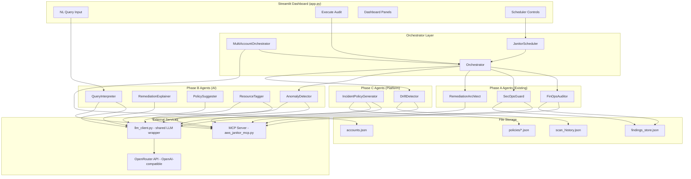
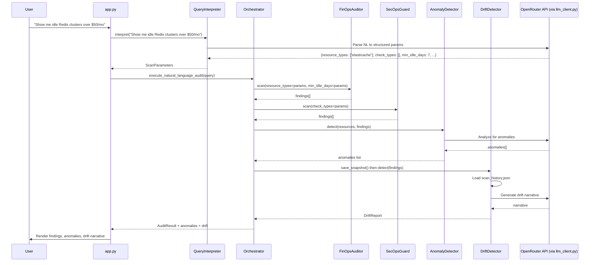
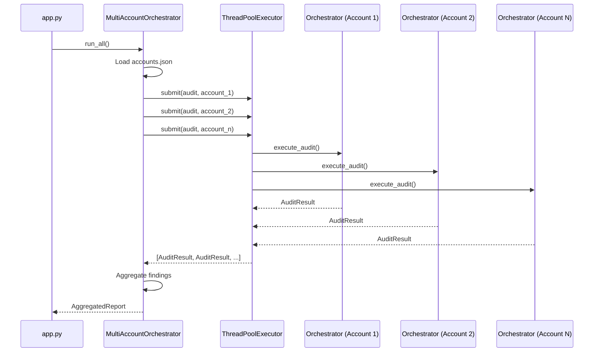
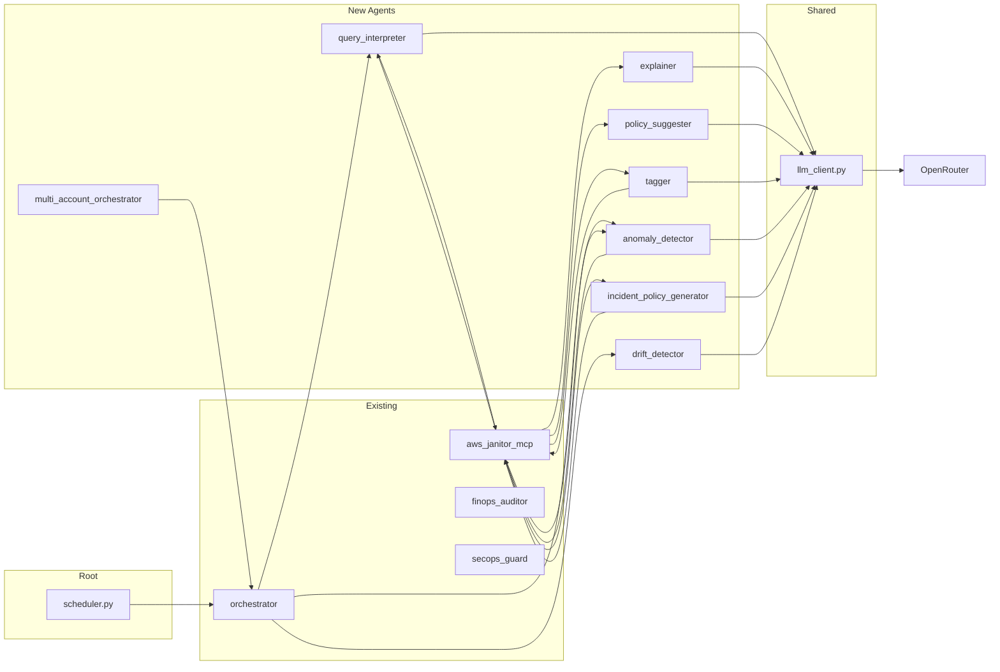

# Design Document: Cloud Janitor Phase B+C (AI & Platform Features)

## Overview

This design covers 9 features spanning Phase B (Tier 2 AI Features) and Phase C (Tier 3 Platform Features) for the Cloud Janitor project. Phase B introduces LLM-powered intelligence via OpenRouter's API (OpenAI-compatible) using claude-haiku-4-5 as the default model — natural language querying, remediation explanations, policy suggestions, auto-tagging, and anomaly detection. Phase C adds platform capabilities — policy generation from incidents, drift detection with narrative, multi-account orchestration, and scheduled scans.

All AI agents follow the same architectural pattern: a dedicated class in `agents/`, a corresponding `@mcp.tool()` in `aws_janitor_mcp.py`, direct import (no network transport), safe-default error handling (never raise from AI), and session state caching in `app.py`. The existing pipeline (FinOps → SecOps → Remediation Architect) remains unchanged; new features integrate as pre-scan filters, post-scan enrichments, or independent workflows.

The implementation uses `JANITOR_BACKEND=fixture` compatibility throughout, ensuring all features work without live AWS credentials during development and testing. All user-supplied input that reaches LLM prompts is treated as untrusted; only allowlisted fields from LLM responses are used in application logic.

## Architecture

### System Context



### Data Flow: NL Query → Scan → Anomaly → Drift → UI



### Multi-Account Concurrent Execution



### Scheduler Lifecycle

```mermaid
statediagram-v2
    [*] --> Idle
    Idle --> Running: start_scheduler()
    Running --> Executing: cron trigger
    Executing --> Running: audit complete
    Running --> Paused: pause_scheduler()
    Paused --> Running: resume_scheduler()
    Running --> Idle: stop_scheduler()
    Paused --> Idle: stop_scheduler()
```

## Components and Interfaces

### Component 1: QueryInterpreter (Phase B)

**Purpose**: Maps free-text natural language queries to structured scan parameters using claude-haiku-4-5.

**Interface**:

```python
class QueryInterpreter:
    def __init__(self, model: str = "claude-haiku-4-5"):
        ...

    def interpret(self, query: str) -> dict:
        """
        Parse NL query into structured scan parameters.

        Returns:
            {
                "resource_types": list[str],    # empty list = all types
                "check_types": list[str],       # empty list = all checks
                "min_idle_days": int,           # default 7
                "intent_summary": str,          # one sentence, shown in UI
                "confidence": float             # 0.0–1.0
            }
        """
        ...
```

**Responsibilities**:

- Parse free-text into structured parameters via LLM
- Return safe defaults on LLM failure (all resources, all checks, min_idle_days=7, confidence=0.0, intent_summary="Could not interpret query.")
- Validate parsed parameters against known resource types (elasticache, ebs, ec2)
- Validate check_types against known checks (security_group, encryption, public_access)

---

### Component 2: RemediationExplainer (Phase B)

**Purpose**: Generates plain-English explanations for remediation plans, describing what will happen and why.

**Interface**:

```python
class RemediationExplainer:
    def __init__(self, model: str = "claude-haiku-4-5"):
        ...

    def explain(self, resource_id: str, finding: dict, remediation_hcl: str, rollback_hcl: str) -> dict:
        """
        Generate explanation for a remediation plan.

        Args:
            resource_id: The resource being remediated
            finding: The finding dict that triggered remediation
            remediation_hcl: The generated Terraform HCL for the fix
            rollback_hcl: The generated Terraform HCL for rollback

        Returns:
            {
                "risk_explanation": str,         # Why this finding is dangerous (2-3 sentences)
                "what_terraform_does": str,      # What the remediation HCL will change (2-3 sentences)
                "what_rollback_restores": str,   # What rollback will undo (1-2 sentences)
            }
        """
        ...
```

**Responsibilities**:

- Explain why a finding is risky in plain English
- Describe what the Terraform remediation will change
- Describe what the rollback will restore
- max_tokens: 400 — this is a UI panel, not a report
- Never raise — return all three keys populated with "Explanation unavailable." on failure

---

### Component 3: PolicySuggester (Phase B)

**Purpose**: After a scan, suggests 3-5 additional policy checks the user might want to enable based on findings patterns.

**Interface**:

```python
class PolicySuggester:
    def __init__(self, model: str = "claude-haiku-4-5"):
        ...

    def suggest(self, findings: list[dict], already_checked: list[str]) -> list[dict]:
        """
        Suggest additional policies based on scan findings.

        Args:
            findings: the findings list from findings_store.json
            already_checked: list of check_types already run (e.g. ["security_group", "encryption"])

        Returns a flat list of up to 5 suggestion dicts:
            [
                {
                    "suggestion_id": str,       # slug, e.g. "check-rds-encryption"
                    "title": str,               # short display name
                    "rationale": str,           # one sentence explaining why
                    "query": str,               # natural language query to pass to QueryInterpreter
                    "priority": "high" | "medium" | "low"
                }
            ]
        """
        ...
```

**Responsibilities**:

- Analyze finding patterns to suggest related checks
- Do not suggest check_types already in already_checked; enforce this by post-processing filtering of LLM output after the API call, not by prompt instruction alone
- Return 3-5 suggestions ranked by priority
- If findings is empty, return a sensible default set of suggestions
- Never raise — return [] on failure

---

### Component 4: ResourceTagger (Phase B)

**Purpose**: Infers environment/team/owner context from resource names, IDs, and metadata patterns.

**Interface**:

```python
class ResourceTagger:
    def __init__(self, model: str = "claude-haiku-4-5", confidence_threshold: float = 0.7):
        ...

    def infer(self, resource_id: str, resource_name: str, existing_tags: dict | None = None) -> dict:
        """
        Infer tagging context for a single resource.

        Args:
            resource_id: The AWS resource ID
            resource_name: Human-readable resource name
            existing_tags: Already-known tags (skips inference for present fields)

        Returns:
            {
                "env": "production" | "staging" | "development" | "unknown",
                "team": str | None,       # e.g. "platform", None if undetectable
                "owner": str | None,      # e.g. "backend-team", None if undetectable
                "risk_level": "high" | "medium" | "low",
                "confidence": float       # 0.0–1.0
            }
        """
        ...

    def infer_batch(self, resources: list[dict]) -> list[dict]:
        """
        Batch inference for multiple resources.
        Each resource dict has: {resource_id, resource_name, existing_tags}
        Returns list of inference dicts in same order as input.
        Uses a single LLM call for up to 10 resources at once.
        """
        ...
```

**Responsibilities**:

- Parse resource naming conventions (prod-, staging-, dev- prefixes)
- Infer team/owner from naming patterns
- If existing_tags contains env/team/owner with non-empty, non-null string values, skip inference for those fields; empty strings and None values are treated as absent and trigger inference normally
- If confidence is strictly below confidence_threshold, set team and owner to None; confidence exactly equal to threshold preserves inferred values
- env must always be one of: production, staging, development, unknown
- Support batch inference for efficiency (single LLM call for up to 10 resources)
- Never raise — return {env: "unknown", team: None, owner: None, risk_level: "low", confidence: 0.0} on failure

---

### Component 5: AnomalyDetector (Phase B)

**Purpose**: Flags suspicious resources not caught by rule-based checks. Integrates post-scan in orchestrator.

**Interface**:

```python
class AnomalyDetector:
    def __init__(self, model: str = "claude-haiku-4-5"):
        ...

    def detect(self, resources: list[dict], findings: list[dict]) -> list[dict]:
        """
        Detect anomalies beyond rule-based findings.

        Args:
            resources: raw resource list from get_cost_data() and get_security_data()
            findings: already-identified findings from FinOps + SecOps agents

        Returns a flat list of anomaly dicts:
            [
                {
                    "anomaly_id": str,           # slug, e.g. "anomaly-001"
                    "resource_id": str,
                    "anomaly_type": str,         # e.g. "unusual_port", "naming_anomaly", "region_mismatch"
                    "description": str,          # plain English, 1-2 sentences
                    "severity": "high" | "medium" | "low",
                    "evidence": str              # specific detail that triggered this anomaly
                }
            ]
        """
        ...
```

**Responsibilities**:

- Compare resources against expected patterns
- Identify unusual port configs, naming anomalies, region mismatches, cost outliers
- Do NOT duplicate findings already in the findings list — check by resource_id
- Integrated into orchestrator post-scan pipeline
- Always call LLM when resources list is non-empty, even if the LLM returns no anomalies; only skip LLM call when resources list is empty
- Never raise — return [] on failure

---

### Component 6: IncidentPolicyGenerator (Phase C)

**Purpose**: Generates preventive scan policies from incident descriptions. Saves as JSON in `policies/` directory.

**Interface**:

```python
class IncidentPolicyGenerator:
    def __init__(self, model: str = "claude-haiku-4-5", policies_dir: Path | None = None):
        ...

    def generate(self, incident_description: str) -> list[dict]:
        """
        Generate preventive scan policies from an incident description.

        Args:
            incident_description: Plain text describing a past incident or near-miss.
                Empty/whitespace → returns [].
                Longer than 2000 chars → truncated before LLM call.

        Returns a list of policy dicts:
            [
                {
                    "policy_id": str,              # slug, e.g. "policy-s3-public-access-check"
                    "policy_name": str,
                    "resource_types": list[str],   # non-empty
                    "check_type": str,             # one of: security_group, encryption, public_access, idle_resource
                    "check_logic_description": str, # plain English
                    "rationale": str,              # why this policy prevents the incident
                    "query": str,                  # natural language query for QueryInterpreter
                    "generated_at": str,           # ISO timestamp
                    "incident_hash": str,          # sha256[:8] of incident_description
                    "version": 1
                }
            ]
        """
        ...

    def list_policies(self) -> list[dict]:
        """List all saved policies from policies/ directory."""
        ...
```

**Responsibilities**:

- Parse incident descriptions to identify preventive checks
- Generate 3-5 structured policy JSON dicts per incident
- Save each policy as: policies/{policy_id}.json
- Create policies/ directory if it does not exist
- If a policy with the same incident_hash already exists, skip writing (return existing)
- Input validation: empty/whitespace → []; >2000 chars → truncate
- Never raise — return [] on failure

---

### Component 7: DriftDetector (Phase C)

**Purpose**: Compares scan snapshots over time and generates LLM narrative explaining what changed. Uses atomic writes with filelock.

**Interface**:

```python
class DriftDetector:
    def __init__(
        self,
        history_path: Path | None = None,   # default: project_root/scan_history.json
        max_snapshots: int = 30,
        model: str = "claude-haiku-4-5",
    ):
        ...

    def save_snapshot(self, scan_id: str, findings: list[dict], anomalies: list[dict], total_waste: float) -> None:
        """
        Append a snapshot to scan_history.json.
        Schema: {scan_id, timestamp, findings, anomalies, total_waste}
        Rotate: keep only the last max_snapshots entries.
        Write atomically: write to scan_history.json.tmp, rename to scan_history.json.
        Thread-safe: acquire a file lock before writing (filelock library).
        """
        ...

    def detect(self, findings: list[dict]) -> dict:
        """
        Compare latest two snapshots in scan_history.json.

        If < 2 snapshots: returns {"drift": None, "reason": "insufficient history"}

        Otherwise returns:
            {
                "new_findings": list[dict],        # findings in latest not in previous
                "resolved_findings": list[dict],   # findings in previous not in latest
                "waste_delta": float,              # positive = more waste, negative = improved
                "critical_delta": int,             # change in critical finding count
                "narrative": str,                  # LLM-generated plain English summary
                "compared_scans": [scan_id_old, scan_id_new]
            }

        Findings matched across snapshots by (resource_id, check_type) pair.
        """
        ...
```

**Responsibilities**:

- Maintain `scan_history.json` with atomic writes (filelock)
- Keep only last 30 snapshots (rotate old entries)
- Compare consecutive scans for new/resolved findings by (resource_id, check_type)
- Generate LLM narrative explaining drift (2-3 sentences, plain text)
- Integrated into orchestrator post-scan
- save_snapshot logs errors to stderr, never raises
- detect returns {drift: None, reason: "error"} on failure, never raises

---

### Component 8: MultiAccountOrchestrator (Phase C)

**Purpose**: Runs concurrent audits across multiple AWS accounts defined in `accounts.json`. Uses ThreadPoolExecutor.

**Interface**:

```python
class MultiAccountOrchestrator:
    def __init__(
        self,
        accounts_path: Path | None = None,   # default: project_root/accounts.json
        max_workers: int = 5,
    ):
        ...

    def run_all(self) -> dict:
        """
        Execute audits across all configured accounts concurrently.

        Returns:
            {
                "accounts_scanned": int,
                "total_findings": int,
                "total_waste": float,
                "critical_count": int,
                "by_account": [
                    {
                        "account_id": str,
                        "account_name": str,
                        "priority": str,
                        "findings": list[dict],
                        "waste": float,
                        "critical_count": int,
                        "status": "success" | "failed",
                        "error": str | None
                    }
                ],
                "aggregate_findings": list[dict],     # all findings across all accounts
                "cross_account_duplicates": int       # findings with same resource_type+check_type across accounts
            }
        """
        ...

    def load_accounts(self) -> list[dict]:
        """Load accounts from accounts.json."""
        ...
```

**Responsibilities**:

- Load account configurations from `accounts.json`
- Run concurrent audits via ThreadPoolExecutor(max_workers=5)
- Each account scan uses a separate Orchestrator instance with isolated findings_store: `findings_store_{account_id}.json`
- Sort by_account by priority: high first, then medium, then low
- Deduplicate cross_account_duplicates by (resource_type, check_type) pairs
- Inject account_id field into all findings before aggregation
- Isolate failures per account (one failure doesn't stop others)
- Missing accounts.json returns empty result dict, never raises

---

### Component 9: JanitorScheduler (Phase C)

**Purpose**: Provides cron-based automated scans using APScheduler. Lives at project root as `scheduler.py` (not in agents/). Manages scheduler lifecycle.

**Interface**:

```python
# scheduler.py (project root)

class JanitorScheduler:
    def __init__(self, project_root: Path | None = None):
        ...

    def start(self) -> None:
        """
        Start the background scheduler. Non-blocking.
        Reads schedule from JANITOR_SCHEDULE env var (default: "0 6 * * *").
        If no scan has run today, runs one immediately.
        """
        ...

    def stop(self) -> None:
        """Stop the scheduler gracefully."""
        ...

    def get_status(self) -> dict:
        """
        Returns:
            {
                "running": bool,
                "schedule": str,            # cron expression in use
                "next_run": str | None,     # ISO timestamp of next scheduled run
                "last_run": str | None,     # ISO timestamp of last completed run
                "runs_completed": int
            }
        """
        ...
```

**Responsibilities**:

- Read schedule from JANITOR_SCHEDULE env var (cron syntax, default "0 6 ** *")
- start() is non-blocking, reads cron from env var (no arguments)
- On startup with no scan history: run one scan immediately
- On each trigger: run Orchestrator.execute_audit(), save to scan_history.json
- Log each run completion to scheduler.log at project root
- Started as a daemon thread from app.py (daemon=True, exits with main process)
- Thread-safe state management
- Graceful shutdown on SIGTERM/SIGINT

## Data Models

### QueryInterpreter Output Schema

```python
# Not a dataclass — returned as a plain dict from interpret()
{
    "resource_types": list[str],    # subset of ["elasticache", "ebs", "ec2"]; empty = all
    "check_types": list[str],       # subset of ["security_group", "encryption", "public_access"]; empty = all
    "min_idle_days": int,           # default 7
    "intent_summary": str,          # one sentence shown in UI
    "confidence": float             # 0.0–1.0
}
```

**Validation Rules**:

- `resource_types` items must be in {"elasticache", "ebs", "ec2"} or empty list
- `check_types` items must be in {"security_group", "encryption", "public_access"} or empty list
- `min_idle_days` >= 0
- `confidence` in [0.0, 1.0]

### AccountConfig (Multi-Account)

```python
# accounts.json schema — each entry:
{
    "account_id": str,         # e.g. "123456789012"
    "account_name": str,       # e.g. "Production"
    "role_arn": str,           # e.g. "arn:aws:iam::123456789012:role/CloudJanitorReadOnly"
    "region": str,             # e.g. "us-east-1" (scalar, not list)
    "priority": str            # "high" | "medium" | "low"
}
```

**Validation Rules**:

- `account_id` must be 12-digit string
- `role_arn` must match `arn:aws:iam::\d{12}:role/.+`
- `region` must be a valid AWS region code (scalar string)
- `priority` must be one of: "high", "medium", "low"

### DriftSnapshot (scan_history.json entry)

```python
# Each entry in the scan_history.json snapshots array:
{
    "scan_id": str,
    "timestamp": str,           # ISO format
    "findings": list[dict],     # full findings list
    "anomalies": list[dict],    # anomaly dicts
    "total_waste": float        # sum of cost_estimate_monthly
}
```

### Policy (policies/{policy_id}.json)

```python
{
    "policy_id": str,              # slug, e.g. "policy-s3-public-access-check"
    "policy_name": str,
    "resource_types": list[str],   # non-empty
    "check_type": str,             # one of: security_group, encryption, public_access, idle_resource
    "check_logic_description": str,
    "rationale": str,
    "query": str,                  # NL query for QueryInterpreter
    "generated_at": str,           # ISO timestamp
    "incident_hash": str,          # sha256[:8] of incident_description
    "version": 1
}
```

**Validation Rules**:

- `policy_id` must be a slug string
- `check_type` in {"security_group", "encryption", "public_access", "idle_resource"}
- `resource_types` must be non-empty list

## Algorithmic Pseudocode

### Algorithm 1: Natural Language Query Interpretation

```python
def interpret(query: str, model: str = "claude-haiku-4-5") -> dict:
    """Map free-text to structured scan parameters via LLM."""
    ...
```

**Preconditions:**

- `query` is a string (may be empty — returns safe defaults)
- `OPENROUTER_API_KEY` is set in environment
- `JANITOR_LLM_MODEL` env var sets the model (default: "anthropic/claude-haiku-4-5")

**Postconditions:**

- Returns dict with keys: resource_types, check_types, min_idle_days, intent_summary, confidence
- On LLM failure: returns safe defaults ([], [], 7, "Could not interpret query.", 0.0)
- `confidence` field reflects LLM's certainty in parsing
- Never raises an exception

**Algorithm:**

```python
ALGORITHM interpret(query)
INPUT: query: str — natural language scan request
OUTPUT: dict with {resource_types, check_types, min_idle_days, intent_summary, confidence}

BEGIN
    SAFE_DEFAULT = {
        "resource_types": [],
        "check_types": [],
        "min_idle_days": 7,
        "intent_summary": "Could not interpret query.",
        "confidence": 0.0
    }

    IF query is empty or whitespace:
        RETURN SAFE_DEFAULT

    prompt = PROMPT_TEMPLATE.format(query=query)

    TRY:
        from llm_client import get_client, DEFAULT_MODEL
        client = get_client()
        response = client.chat.completions.create(
            model=DEFAULT_MODEL,
            max_tokens=256,
            messages=[{"role": "user", "content": prompt}]
        )
        parsed = json.loads(response.choices[0].message.content)
        
        # Validate and sanitize
        params = {
            "resource_types": [r for r in parsed.get("resource_types", []) if r in VALID_RESOURCE_TYPES],
            "check_types": [c for c in parsed.get("check_types", []) if c in VALID_CHECK_TYPES],
            "min_idle_days": max(0, int(parsed.get("min_idle_days", 7))),
            "intent_summary": str(parsed.get("intent_summary", "Scan requested.")),
            "confidence": min(1.0, max(0.0, float(parsed.get("confidence", 0.5))))
        }
        RETURN params
    EXCEPT Exception:
        RETURN SAFE_DEFAULT
END
```

### Algorithm 2: Anomaly Detection (Post-Scan)

```python
def detect(resources: list[dict], findings: list[dict]) -> list[dict]:
    """Flag suspicious resources not caught by rules. Returns flat list of anomaly dicts."""
    ...
```

**Preconditions:**

- `resources` is a valid list of resource dicts from MCP (may be empty)
- `findings` is a list of already-identified findings from FinOps + SecOps
- OPENROUTER_API_KEY is set in environment

**Postconditions:**

- Returns a flat list of anomaly dicts (not wrapped in a dict)
- Each anomaly has: anomaly_id, resource_id, anomaly_type, description, severity, evidence
- Never includes resources already in findings (deduplicates by resource_id)
- Never raises — returns [] on any failure

**Algorithm:**

```python
ALGORITHM detect(resources, findings)
INPUT: resources: list[dict], findings: list[dict]
OUTPUT: list[dict] — flat list of anomaly dicts

BEGIN
    already_flagged_ids = {f["resource_id"] for f in findings}
    unflagged_resources = [r for r in resources if r.get("id", r.get("resource_id")) not in already_flagged_ids]

    IF len(unflagged_resources) == 0:
        RETURN []

    prompt = ANOMALY_PROMPT_TEMPLATE.format(
        already_flagged_ids=list(already_flagged_ids),
        resources_json=json.dumps(unflagged_resources[:50])
    )

    TRY:
        response = call_llm(prompt)
        anomalies = json.loads(response)
        
        # Filter: only keep anomalies for resources not already flagged
        valid_anomalies = [a for a in anomalies if a["resource_id"] not in already_flagged_ids]
        
        RETURN valid_anomalies
    EXCEPT Exception:
        RETURN []
END
```

### Algorithm 3: Drift Detection with Atomic Write

```python
def save_snapshot(scan_id: str, findings: list[dict], anomalies: list[dict], total_waste: float) -> None:
    """Persist snapshot to scan_history.json atomically."""
    ...

def detect(findings: list[dict]) -> dict:
    """Compare latest two snapshots and generate narrative."""
    ...
```

**Preconditions:**

- `findings` is a valid list of Finding dicts
- history_path points to scan_history.json location (may not exist yet)
- filelock library available

**Postconditions:**

- scan_history.json is updated atomically (write to .tmp, rename)
- Only last 30 snapshots kept (rotate oldest)
- detect() returns drift report or {drift: None, reason: "insufficient history"}
- Findings matched across snapshots by (resource_id, check_type) pair
- File lock is always released (even on error)
- save_snapshot never raises (logs to stderr)
- detect never raises (returns {drift: None, reason: "error"})

**Algorithm:**

```python
ALGORITHM save_snapshot(scan_id, findings, anomalies, total_waste)
INPUT: scan_id: str, findings: list[dict], anomalies: list[dict], total_waste: float
OUTPUT: None (writes to scan_history.json)

BEGIN
    # Clean up stale tmp file from a previous crashed write
    tmp_path = history_path.with_suffix(".json.tmp")
    TRY:
        IF tmp_path.exists() AND (now() - tmp_path.stat().st_mtime) > 60:
            tmp_path.unlink()
    EXCEPT Exception AS e:
        sys.stderr.write(f"Failed to clean stale tmp file: {e}\n")
        RETURN  # Do not proceed if cleanup fails

    lock = FileLock(str(history_path) + ".lock", timeout=10)
    TRY:
        WITH lock:
            IF history_path.exists():
                history = json.loads(history_path.read_text())
            ELSE:
                history = []

            snapshot = {
                "scan_id": scan_id,
                "timestamp": now_iso(),
                "findings": findings,
                "anomalies": anomalies,
                "total_waste": total_waste
            }
            history.append(snapshot)

            # Rotate: keep only last max_snapshots (30)
            IF len(history) > 30:
                history = history[-30:]

            # Atomic write: tmp then rename
            tmp_path = history_path.with_suffix(".json.tmp")
            tmp_path.write_text(json.dumps(history, indent=2))
            tmp_path.rename(history_path)
    EXCEPT Exception AS e:
        sys.stderr.write(f"save_snapshot error: {e}\n")
END

ALGORITHM detect(findings)
INPUT: findings: list[dict]
OUTPUT: drift report dict

BEGIN
    TRY:
        IF NOT history_path.exists():
            RETURN {"drift": None, "reason": "insufficient history"}

        history = json.loads(history_path.read_text())
        IF len(history) < 2:
            RETURN {"drift": None, "reason": "insufficient history"}

        previous = history[-2]
        current = history[-1]

        # Match by (resource_id, check_type) pair — use check_type when present, fall back to category
        def match_key(f):
            return (f["resource_id"], f.get("check_type", f.get("category", "")))

        prev_keys = {match_key(f) for f in previous["findings"]}
        curr_keys = {match_key(f) for f in current["findings"]}

        new_keys = curr_keys - prev_keys
        resolved_keys = prev_keys - curr_keys

        new_findings = [f for f in current["findings"] if match_key(f) in new_keys]
        resolved_findings = [f for f in previous["findings"] if match_key(f) in resolved_keys]

        waste_delta = current["total_waste"] - previous["total_waste"]
        critical_delta = (
            sum(1 for f in current["findings"] if f.get("severity") == "CRITICAL") -
            sum(1 for f in previous["findings"] if f.get("severity") == "CRITICAL")
        )

        # Generate narrative via LLM
        narrative = generate_drift_narrative(new_findings, resolved_findings, waste_delta, critical_delta)

        RETURN {
            "new_findings": new_findings,
            "resolved_findings": resolved_findings,
            "waste_delta": waste_delta,
            "critical_delta": critical_delta,
            "narrative": narrative,
            "compared_scans": [previous["scan_id"], current["scan_id"]]
        }
    EXCEPT Exception:
        RETURN {"drift": None, "reason": "error"}
END
```

### Algorithm 4: Multi-Account Concurrent Execution

```python
def run_all(accounts_path: Path, max_workers: int = 5) -> dict:
    """Execute audits concurrently across accounts."""
    ...
```

**Preconditions:**

- `accounts_path` points to valid accounts.json (or file not found → empty result)
- `max_workers` > 0
- Each account in accounts.json has: account_id, account_name, role_arn, region, priority

**Postconditions:**

- All accounts are audited (or error recorded per-account)
- Single account failure does not block others
- Results aggregated across all accounts with account_id injected into each finding
- by_account sorted by priority: high first, then medium, then low
- Thread safety maintained via isolated Orchestrator instances with separate findings stores

**Algorithm:**

```python
ALGORITHM run_all(accounts_path, max_workers)
INPUT: accounts_path: Path, max_workers: int
OUTPUT: dict with {accounts_scanned, total_findings, total_waste, critical_count, by_account, aggregate_findings, cross_account_duplicates}

BEGIN
    IF NOT accounts_path.exists():
        RETURN {"accounts_scanned": 0, "total_findings": 0, "total_waste": 0.0,
                "critical_count": 0, "by_account": [], "aggregate_findings": [],
                "cross_account_duplicates": 0}

    accounts = json.loads(accounts_path.read_text())
    by_account = []

    WITH ThreadPoolExecutor(max_workers=max_workers) AS executor:
        futures = {}
        FOR account IN accounts:
            # Each account gets isolated findings store
            future = executor.submit(audit_single_account, account)
            futures[future] = account

        FOR future IN as_completed(futures):
            account = futures[future]
            TRY:
                result = future.result(timeout=300)
                # Inject account_id into each finding
                findings = result.findings
                FOR f IN findings:
                    f["account_id"] = account["account_id"]
                by_account.append({
                    "account_id": account["account_id"],
                    "account_name": account["account_name"],
                    "priority": account.get("priority", "low"),
                    "findings": findings,
                    "waste": sum(f.get("cost_estimate_monthly", 0) for f in findings),
                    "critical_count": sum(1 for f in findings if f.get("severity") == "CRITICAL"),
                    "status": "success",
                    "error": None
                })
            EXCEPT (Exception, concurrent.futures.TimeoutError, concurrent.futures.CancelledError) AS e:
                by_account.append({
                    "account_id": account["account_id"],
                    "account_name": account["account_name"],
                    "priority": account.get("priority", "low"),
                    "findings": [],
                    "waste": 0.0,
                    "critical_count": 0,
                    "status": "failed",
                    "error": str(e)
                })

    # Sort by priority: high first
    priority_order = {"high": 0, "medium": 1, "low": 2}
    by_account.sort(key=lambda a: priority_order.get(a["priority"], 3))

    # Aggregate
    aggregate_findings = []
    FOR acct IN by_account:
        aggregate_findings.extend(acct["findings"])

    # Count cross-account duplicates by (resource_type, check_type)
    type_pairs = [(f.get("resource_type"), f.get("category")) for f in aggregate_findings]
    cross_account_duplicates = len(type_pairs) - len(set(type_pairs))

    RETURN {
        "accounts_scanned": len(accounts),
        "total_findings": len(aggregate_findings),
        "total_waste": sum(a["waste"] for a in by_account),
        "critical_count": sum(a["critical_count"] for a in by_account),
        "by_account": by_account,
        "aggregate_findings": aggregate_findings,
        "cross_account_duplicates": cross_account_duplicates
    }
END
```

**Loop Invariants:**

- For the futures loop: all completed futures have been processed
- by_account grows monotonically (one entry per completed future)

### Algorithm 5: Scheduled Scans (APScheduler)

```python
def start(self) -> None:
    """Start cron-based automated scans. Reads schedule from JANITOR_SCHEDULE env var."""
    ...
```

**Preconditions:**

- JANITOR_SCHEDULE env var contains valid cron syntax (5-field) or uses default "0 6 ** *"
- APScheduler library available
- project_root is set

**Postconditions:**

- BackgroundScheduler is running with configured trigger
- `get_status()` returns running=True
- Scheduler shuts down cleanly on application exit
- If no scan has run today, runs one immediately on start
- Multiple `start()` calls are idempotent (stops previous, starts new)

**Algorithm:**

```python
ALGORITHM start(self)
INPUT: None (reads JANITOR_SCHEDULE from env var)
OUTPUT: None (starts background scheduler)

BEGIN
    cron_expression = os.environ.get("JANITOR_SCHEDULE", "0 6 * * *")

    IF self._scheduler IS NOT None AND self._scheduler.running:
        self._scheduler.shutdown(wait=False)

    self._scheduler = BackgroundScheduler()

    # Parse cron fields
    fields = parse_cron(cron_expression)  # minute, hour, day, month, day_of_week

    self._scheduler.add_job(
        func=self._execute_scheduled_audit,
        trigger=CronTrigger(**fields),
        id="janitor_audit",
        replace_existing=True,
    )

    self._scheduler.start()
    self._schedule = cron_expression
    self._running = True

    # If no scan has run today, run one immediately
    IF NOT self._has_run_today():
        self._execute_scheduled_audit()
END

ALGORITHM _execute_scheduled_audit(self)
INPUT: None (uses self._project_root)
OUTPUT: None (records in history, writes to scheduler.log)

BEGIN
    run_record = {"started_at": now_iso(), "status": "running"}
    TRY:
        orch = Orchestrator(project_root=self._project_root)
        result = orch.execute_audit()
        run_record["status"] = "success"
        run_record["findings_count"] = len(result.findings)
    EXCEPT Exception AS e:
        run_record["status"] = "error"
        run_record["error"] = str(e)
    FINALLY:
        run_record["completed_at"] = now_iso()
        self._runs_completed += 1
        self._last_run = run_record["completed_at"]
        # Use RotatingFileHandler — cap at 10MB, keep 3 backups
        import logging.handlers
        log_path = self._project_root / "scheduler.log"
        handler = logging.handlers.RotatingFileHandler(
            log_path, maxBytes=10 * 1024 * 1024, backupCount=3
        )
        handler.emit(logging.makeLogRecord({"msg": str(run_record)}))
        handler.close()
END
```

### Algorithm 6: Policy From Incident

```python
def generate(incident_description: str) -> list[dict]:
    """Generate preventive policies from incident description. Returns list."""
    ...
```

**Preconditions:**

- `incident_description` is a string (empty → returns [])
- OPENROUTER_API_KEY is set in environment
- `policies/` directory exists or can be created

**Postconditions:**

- Returns list of policy dicts (3-5 items on success, [] on failure)
- Each policy JSON file written to `policies/<policy_id>.json`
- If same incident_hash already exists on disk, returns existing policies without re-generating
- On LLM failure: returns [], no files written
- Input >2000 chars is truncated before LLM call
- Never raises

**Algorithm:**

```python
ALGORITHM generate(incident_description)
INPUT: incident_description: str
OUTPUT: list[dict] — list of policy dicts

BEGIN
    IF incident_description is empty or whitespace:
        RETURN []

    # Truncate long input
    IF len(incident_description) > 2000:
        incident_description = incident_description[:2000]

    # Check for existing policies with same incident_hash
    incident_hash = sha256(incident_description.encode()).hexdigest()[:8]
    existing = find_policies_by_incident_hash(incident_hash)
    IF existing:
        RETURN existing

    prompt = INCIDENT_PROMPT_TEMPLATE.format(incident_description=incident_description)

    TRY:
        response = call_llm(prompt)
        parsed = json.loads(response)  # expects JSON array

        policies = []
        FOR item IN parsed:
            # Validate policy_id is a safe slug before constructing file path
            raw_id = str(item.get("policy_id", ""))
            IF NOT re.match(r"^[a-z0-9\-]+$", raw_id):
                sys.stderr.write(f"Skipping policy with unsafe policy_id: {raw_id!r}\n")
                CONTINUE

            policy = {
                "policy_id": raw_id,
                "policy_name": item["policy_name"],
                "resource_types": item["resource_types"],
                "check_type": item["check_type"],
                "check_logic_description": item["check_logic_description"],
                "rationale": item["rationale"],
                "query": item["query"],
                "generated_at": now_iso(),
                "incident_hash": incident_hash,
                "version": 1
            }
            policies.append(policy)

            # Write to policies directory
            policies_dir.mkdir(parents=True, exist_ok=True)
            policy_path = policies_dir / f"{policy['policy_id']}.json"
            policy_path.write_text(json.dumps(policy, indent=2))

        RETURN policies
    EXCEPT Exception:
        RETURN []
END
```

## Key Functions with Formal Specifications

### MCP Tool: interpret_query

```python
@mcp.tool()
def interpret_query(user_query: str) -> dict:
    """
    Map a natural language query to structured scan parameters.
    Delegates to QueryInterpreter.
    Returns: {resource_types, check_types, min_idle_days, intent_summary, confidence}
    """
    from agents.query_interpreter import QueryInterpreter
    interpreter = QueryInterpreter()
    return interpreter.interpret(user_query)
```

**Preconditions:**

- `user_query` is a string (may be empty)

**Postconditions:**

- Returns dict with keys: resource_types, check_types, min_idle_days, intent_summary, confidence
- resource_types and check_types are lists (may be empty)
- min_idle_days is non-negative int
- confidence in [0.0, 1.0]
- Never raises

---

### MCP Tool: explain_remediation

```python
@mcp.tool()
def explain_remediation(
    resource_id: str,
    finding: dict,
    remediation_hcl: str,
    rollback_hcl: str,
) -> dict:
    """
    Generate plain-English explanation for a remediation plan.
    Returns: {risk_explanation, what_terraform_does, what_rollback_restores}
    """
    from agents.explainer import RemediationExplainer
    explainer = RemediationExplainer()
    return explainer.explain(resource_id, finding, remediation_hcl, rollback_hcl)
```

**Preconditions:**

- `resource_id` is non-empty string
- `finding` is a valid Finding dict
- `remediation_hcl` and `rollback_hcl` are HCL strings

**Postconditions:**

- Returns dict with keys: risk_explanation, what_terraform_does, what_rollback_restores
- All three values are non-empty strings
- On failure: all three keys populated with "Explanation unavailable."
- Never raises

---

### MCP Tool: suggest_policies

```python
@mcp.tool()
def suggest_policies(findings: list, already_checked: list | None = None) -> list:
    """
    Suggest additional checks based on current findings.
    Returns list of suggestion dicts.
    """
    from agents.policy_suggester import PolicySuggester
    suggester = PolicySuggester()
    return suggester.suggest(findings, already_checked or [])
```

**Preconditions:**

- `findings` is a list of Finding dicts (may be empty)
- `already_checked` is a list of check_type strings (may be None)

**Postconditions:**

- Returns a flat list of 0-5 suggestion dicts
- Each suggestion has: suggestion_id, title, rationale, query, priority
- Suggestions never include check_types already in already_checked
- Never raises

---

### MCP Tool: infer_resource_context

```python
@mcp.tool()
def infer_resource_context(
    resource_id: str,
    resource_name: str,
    existing_tags: dict | None = None,
) -> dict:
    """
    Infer env, team, owner, risk_level from resource identity.
    Returns inference dict with confidence score.
    """
    from agents.tagger import ResourceTagger
    tagger = ResourceTagger()
    return tagger.infer(resource_id, resource_name, existing_tags)
```

**Preconditions:**

- `resource_id` is non-empty string
- `resource_name` is a string
- `existing_tags` is a dict or None

**Postconditions:**

- Returns dict with keys: env, team, owner, risk_level, confidence
- env is always one of: "production", "staging", "development", "unknown"
- team and owner are str or None
- confidence in [0.0, 1.0]
- Never raises

---

### MCP Tool: detect_anomalies

```python
@mcp.tool()
def detect_anomalies(resources: list, findings: list) -> list:
    """
    Detect anomalies not caught by rule-based checks.
    Args:
        resources: raw resource data from get_cost_data() + get_security_data()
        findings: already-identified findings
    Returns list of anomaly dicts.
    """
    from agents.anomaly_detector import AnomalyDetector
    detector = AnomalyDetector()
    return detector.detect(resources, findings)
```

**Preconditions:**

- `resources` is a list of resource dicts
- `findings` is a list of Finding dicts

**Postconditions:**

- Returns a flat list of anomaly dicts
- Each anomaly has: anomaly_id, resource_id, anomaly_type, description, severity, evidence
- Anomaly resource_ids are disjoint from finding resource_ids
- Never raises

---

### MCP Tool: policy_from_incident

```python
@mcp.tool()
def policy_from_incident(incident_description: str) -> list:
    """
    Generate preventive scan policies from an incident description.
    Saves policies to policies/ directory.
    Returns list of generated policy dicts.
    """
    from agents.incident_policy_generator import IncidentPolicyGenerator
    generator = IncidentPolicyGenerator()
    return generator.generate(incident_description)
```

**Preconditions:**

- `incident_description` is a string (may be empty)

**Postconditions:**

- Returns a list of policy dicts (may be empty)
- Each policy has: policy_id, policy_name, resource_types, check_type, check_logic_description, rationale, query, generated_at, incident_hash, version
- On empty/whitespace input: returns []
- On failure: returns []
- Never raises

---

### MCP Tool: aggregate_findings

```python
@mcp.tool()
def aggregate_findings(account_results: list) -> dict:
    """
    Aggregate findings across multiple accounts.
    Input: [{account_id, account_name, findings}]
    Returns unified view with per-account breakdown and duplicate count.
    """
    ...
```

**Preconditions:**

- `account_results` is a list of dicts with account_id, account_name, findings

**Postconditions:**

- Returns dict with aggregated view and cross_account_duplicates count
- Never raises

---

### Orchestrator: execute_natural_language_audit

```python
def execute_natural_language_audit(self, query: str) -> AuditResult:
    """Execute audit pipeline filtered by NL query parameters."""
    ...
```

**Preconditions:**

- `query` is non-empty string
- Orchestrator is properly initialized

**Postconditions:**

- Interprets query, applies filters, runs pipeline
- Returns AuditResult (same schema as execute_audit)
- On interpretation failure: falls back to full unfiltered scan
- Anomaly detection and drift detection run post-scan

## Example Usage

```python
# Example 1: Natural Language Query
from agents.query_interpreter import QueryInterpreter

interpreter = QueryInterpreter()
params = interpreter.interpret("find all unencrypted storage with public access")
# params = {
#     "resource_types": [],
#     "check_types": ["encryption", "public_access"],
#     "min_idle_days": 7,
#     "intent_summary": "Scan all resources for unencrypted storage with public access",
#     "confidence": 0.95
# }

# Example 2: Remediation Explanation
from agents.explainer import RemediationExplainer

explainer = RemediationExplainer()
explanation = explainer.explain(
    resource_id="sg-open-redis-01",
    finding={"title": "Open Redis port", "severity": "HIGH", "description": "..."},
    remediation_hcl="resource \"aws_security_group_rule\" ...",
    rollback_hcl="resource \"aws_security_group_rule\" ..."
)
# explanation = {
#     "risk_explanation": "This security group allows anyone on the internet to connect to your Redis instance on port 6379.",
#     "what_terraform_does": "This Terraform will replace the 0.0.0.0/0 rule with one restricted to your VPC CIDR.",
#     "what_rollback_restores": "If rolled back, the original open rule will be restored."
# }

# Example 3: Multi-Account Execution
from agents.multi_account_orchestrator import MultiAccountOrchestrator

mao = MultiAccountOrchestrator(max_workers=5)
report = mao.run_all()
# report["accounts_scanned"] == 2
# report["total_findings"] == 12
# report["by_account"][0]["priority"] == "high"

# Example 4: Scheduled Scan
from scheduler import JanitorScheduler

scheduler = JanitorScheduler(project_root=PROJECT_ROOT)
scheduler.start()  # reads JANITOR_SCHEDULE env var, no args
status = scheduler.get_status()
# status = {"running": True, "schedule": "0 6 * * *", "next_run": "2025-01-16T06:00:00", ...}

# Example 5: Drift Detection
from agents.drift_detector import DriftDetector

detector = DriftDetector(history_path=PROJECT_ROOT / "scan_history.json")
detector.save_snapshot(scan_id="scan-001", findings=findings, anomalies=[], total_waste=150.0)
drift = detector.detect(current_findings)
# drift = {
#     "new_findings": [{"resource_id": "vol-new123", ...}],
#     "resolved_findings": [{"resource_id": "vol-old456", ...}],
#     "waste_delta": -50.0,
#     "critical_delta": -1,
#     "narrative": "One critical finding resolved. Monthly waste decreased by $50.",
#     "compared_scans": ["scan-001", "scan-002"]
# }

# Example 6: Policy from Incident
from agents.incident_policy_generator import IncidentPolicyGenerator

gen = IncidentPolicyGenerator()
policies = gen.generate(
    "An S3 bucket was accidentally made public, exposing customer data for 2 hours."
)
# policies = [
#     {
#         "policy_id": "policy-s3-public-access-check",
#         "policy_name": "S3 Public Access Check",
#         "resource_types": ["s3"],
#         "check_type": "public_access",
#         "check_logic_description": "Detect S3 buckets with public read or write ACLs",
#         "rationale": "The incident involved data exposed via a public S3 bucket",
#         "query": "find all S3 buckets with public access enabled",
#         "generated_at": "2025-06-28T12:00:00Z",
#         "incident_hash": "a1b2c3d4",
#         "version": 1
#     },
#     ...
# ]
```

## Correctness Properties

*A property is a characteristic or behavior that should hold true across all valid executions of a system-essentially, a formal statement about what the system should do. Properties serve as the bridge between human-readable specifications and machine-verifiable correctness guarantees.*

### Property 1: Never-Raise Guarantee

*For any* input (including empty strings, malformed dicts, None values, and adversarial content) and *for any* AI agent in {QueryInterpreter, RemediationExplainer, PolicySuggester, ResourceTagger, AnomalyDetector, IncidentPolicyGenerator, DriftDetector}, calling the agent's primary method SHALL NOT raise an unhandled exception to the caller.

**Validates: Requirements 1.8**

### Property 2: Safe Defaults on LLM Failure

*For any* AI agent and *for any* input, when the LLM call raises an exception or returns unparseable output, the agent SHALL return its documented safe-default value with correct schema (all required keys present, correct types, valid enum values).

**Validates: Requirements 1.1, 1.2, 1.3, 1.4, 1.5, 1.6, 1.7, 2.5, 2.6**

### Property 3: QueryInterpreter Output Validity

*For any* string input to interpret(), the returned dict SHALL satisfy: confidence ∈ [0.0, 1.0], all resource_types items ∈ {"elasticache", "ebs", "ec2"}, all check_types items ∈ {"security_group", "encryption", "public_access"}, min_idle_days ≥ 0, and intent_summary is a non-empty string.

**Validates: Requirements 2.1, 2.2, 2.3, 2.4, 2.7**

### Property 4: RemediationExplainer Schema Completeness

*For any* combination of resource_id, finding dict, remediation_hcl, and rollback_hcl inputs, the explain() method SHALL return a dict containing exactly three keys: risk_explanation, what_terraform_does, what_rollback_restores — each being a non-empty string.

**Validates: Requirements 3.4, 1.2**

### Property 5: PolicySuggester Output Bounds and Exclusion

*For any* findings list and *for any* already_checked list, the suggest() method SHALL return a list of 0-5 dicts, each containing suggestion_id, title, rationale, query, and priority ∈ {"high", "medium", "low"}, and no suggestion SHALL reference a check_type already in already_checked.

**Validates: Requirements 4.1, 4.2, 4.3, 4.4**

### Property 6: ResourceTagger Enum and Confidence Constraints

*For any* resource_id and resource_name input, the infer() method SHALL return env ∈ {"production", "staging", "development", "unknown"}, risk_level ∈ {"high", "medium", "low"}, and confidence ∈ [0.0, 1.0]. If confidence is strictly below confidence_threshold, team and owner SHALL be None; if confidence equals confidence_threshold exactly, inferred values SHALL be preserved.

**Validates: Requirements 5.1, 5.2, 5.3, 5.6**

### Property 7: ResourceTagger Existing Tags Passthrough

*For any* resource where existing_tags contains env, team, or owner keys, those fields in the output SHALL equal the existing_tags values regardless of LLM inference results.

**Validates: Requirements 5.4**

### Property 8: AnomalyDetector Disjoint Resource IDs

*For any* resources list and *for any* findings list, the set of resource_ids in detect() output SHALL be disjoint from the set of resource_ids in the findings input.

**Validates: Requirements 6.1**

### Property 9: AnomalyDetector Output Schema

*For any* input, detect() SHALL return a flat list where each element contains: anomaly_id, resource_id, anomaly_type, description, severity ∈ {"high", "medium", "low"}, and evidence.

**Validates: Requirements 6.2, 6.3**

### Property 10: IncidentPolicyGenerator Idempotency

*For any* incident description, calling generate() twice with the same text SHALL produce the same result without a second LLM call (matched by incident_hash).

**Validates: Requirements 7.6**

### Property 11: IncidentPolicyGenerator File Consistency

*For any* successfully generated policy in the return list, a corresponding file SHALL exist at policies/{policy_id}.json, and the file contents SHALL match the returned dict. When generate() returns [] due to failure, no new files SHALL be created.

**Validates: Requirements 7.2, 7.1**

### Property 12: IncidentPolicyGenerator Schema and Bounds

*For any* valid non-empty incident description (≤2000 chars), generate() SHALL return 3-5 policy dicts, each containing: policy_id, policy_name, resource_types (non-empty list), check_type ∈ {"security_group", "encryption", "public_access", "idle_resource"}, check_logic_description, rationale, query, generated_at (ISO timestamp), incident_hash (8-char hex), version=1.

**Validates: Requirements 7.1, 7.3, 7.7**

### Property 13: IncidentPolicyGenerator Input Validation

*For any* whitespace-only string, generate() SHALL return [] without writing files. *For any* string exceeding 2000 characters, the LLM SHALL receive at most 2000 characters of the description.

**Validates: Requirements 7.4, 7.5**

### Property 14: DriftDetector Max Snapshots Invariant

*For any* sequence of save_snapshot() calls, the number of entries in scan_history.json SHALL never exceed 30.

**Validates: Requirements 8.3**

### Property 15: DriftDetector Waste Delta Correctness

*For any* two consecutive snapshots with total_waste values W_prev and W_curr, detect() SHALL return waste_delta = W_curr - W_prev.

**Validates: Requirements 8.4**

### Property 16: DriftDetector Finding Diff Correctness

*For any* two consecutive snapshots, new_findings SHALL contain exactly those findings present in the current snapshot but absent from the previous snapshot (matched by resource_id, check_type pair), and resolved_findings SHALL contain exactly those present in the previous but absent from the current.

**Validates: Requirements 8.5**

### Property 17: DriftDetector Output Schema

*For any* history with ≥2 snapshots, detect() SHALL return a dict containing: new_findings (list), resolved_findings (list), waste_delta (float), critical_delta (int), narrative (string), compared_scans (list of 2 scan_ids).

**Validates: Requirements 8.8**

### Property 18: MultiAccountOrchestrator Fault Isolation

*For any* set of account configurations where one account's audit raises an exception, the remaining accounts' audit results SHALL be unaffected (status="success" with correct findings).

**Validates: Requirements 9.2**

### Property 19: MultiAccountOrchestrator Account ID Injection

*For any* successful multi-account audit, every finding in aggregate_findings SHALL contain an "account_id" field matching the account it originated from.

**Validates: Requirements 9.3**

### Property 20: MultiAccountOrchestrator Priority Sorting

*For any* set of account results, the by_account list SHALL be sorted by priority with "high" first, then "medium", then "low".

**Validates: Requirements 9.4**

### Property 21: JanitorScheduler Status Schema

*For any* scheduler state (running or stopped), get_status() SHALL return a dict with keys: running (bool), schedule (str), next_run (str|None), last_run (str|None), runs_completed (int).

**Validates: Requirements 10.4**

### Property 22: JanitorScheduler Idempotent Start

*For any* number of sequential start() calls, exactly one scheduler instance SHALL be running afterward.

**Validates: Requirements 10.5**

## Error Handling

### Error Scenario 1: LLM API Unavailable

**Condition**: OpenRouter API returns connection error, timeout, or rate limit
**Response**: All AI agents catch the exception and return safe defaults
**Recovery**:

- QueryInterpreter → returns empty filters (full scan)
- RemediationExplainer → returns generic template explanation
- PolicySuggester → returns empty suggestions list
- AnomalyDetector → returns empty anomalies
- DriftDetector → returns no-drift report (narrative = "")
- IncidentPolicyGenerator → returns []
- ResourceTagger → returns "unknown" tags with confidence 0.0

### Error Scenario 2: Invalid JSON from LLM

**Condition**: LLM returns malformed or unparseable JSON
**Response**: Same safe-default pattern as API unavailable
**Recovery**: Log warning, return defaults. No retry (avoid cascading latency).

### Error Scenario 3: scan_history.json Locked (Drift)

**Condition**: filelock timeout (another process holds the lock)
**Response**: DriftDetector returns no-drift report without recording
**Recovery**: Next scan attempt will succeed when lock is released. Warning logged.

### Error Scenario 4: accounts.json Missing/Invalid (Multi-Account)

**Condition**: File doesn't exist or contains invalid JSON
**Response**: MultiAccountOrchestrator returns error with 0 accounts audited
**Recovery**: User must create/fix accounts.json. Meaningful error message surfaced in UI.

### Error Scenario 5: Single Account Failure (Multi-Account)

**Condition**: One account's audit raises an exception
**Response**: Exception caught per-account; other accounts continue
**Recovery**: Failed account recorded with error message in results_by_account

### Error Scenario 6: Scheduler Job Failure

**Condition**: Scheduled audit execution raises an exception
**Response**: Exception caught in _execute_scheduled_audit; recorded in history
**Recovery**: Scheduler continues running; next trigger fires normally

### Error Scenario 7: policies/ Directory Not Writable

**Condition**: Permission error when writing policy JSON
**Response**: IncidentPolicyGenerator returns [] (empty list)
**Recovery**: User must fix directory permissions. Error logged to stderr.

### Error Scenario 8: JANITOR_BACKEND=fixture with New Tools

**Condition**: New MCP tools called when backend is fixture
**Response**: FixtureProvider returns appropriate mock data for all new tools
**Recovery**: All features work in fixture mode — no live AWS required for development

### Error Scenario 9: Missing OPENROUTER_API_KEY

**Condition**: `OPENROUTER_API_KEY` environment variable is not set when `get_client()` is called
**Response**: `llm_client.get_client()` raises `EnvironmentError("OPENROUTER_API_KEY is not set")`. All AI agents catch this in their standard exception handler and return safe defaults.
**Recovery**: User must set the environment variable. Error message names the missing variable without echoing any credential values.

### Error Scenario 10: Unsafe policy_id from LLM

**Condition**: LLM returns a policy_id containing path traversal characters (e.g. `../../etc/passwd`) or characters outside `[a-z0-9\-]`
**Response**: `IncidentPolicyGenerator` skips the policy, logs the unsafe ID to stderr, continues processing remaining policies in the response.
**Recovery**: Remaining valid policies are returned. No file is written for the skipped policy.

### Error Scenario 11: Stale .tmp file on DriftDetector startup

**Condition**: `scan_history.json.tmp` exists from a previous crashed write and is older than 60 seconds
**Response**: `DriftDetector.save_snapshot()` deletes the stale `.tmp` file before acquiring the file lock.
**Recovery**: Normal atomic write proceeds. If `.tmp` deletion fails, the error is logged to stderr and `save_snapshot` returns without writing (same as any other write failure).

### Error Scenario 12: ThreadPoolExecutor CancelledError in multi-account scan

**Condition**: A future is cancelled or raises `concurrent.futures.CancelledError` or `concurrent.futures.TimeoutError`
**Response**: `MultiAccountOrchestrator` catches `(Exception, concurrent.futures.TimeoutError, concurrent.futures.CancelledError)` in the futures completion loop and records the account as `status="failed"` with the exception message.
**Recovery**: Remaining accounts are unaffected. The failed account appears in `by_account` with `findings=[]` and `error` populated.

## Testing Strategy

### Unit Testing Approach

Each new agent class requires:

1. **Known expected value test**: Concrete input → concrete expected output (not derived from function under test)
2. **Negative test**: Invalid input → graceful handling (no raise, safe defaults)
3. **Schema validation**: Output dicts checked for required keys and correct types
4. **LLM mocking**: Mock `llm_client.get_client` — never the agent method itself. Example pattern:

   ```python
   with patch("llm_client.get_client") as mock_client:
       mock_client.return_value.chat.completions.create.return_value.choices[0].message.content = '{"key": "value"}'
   ```

Key test files:

- `tests/test_query_interpreter.py`
- `tests/test_explainer.py`
- `tests/test_policy_suggester.py`
- `tests/test_tagger.py`
- `tests/test_anomaly_detector.py`
- `tests/test_incident_policy_generator.py`
- `tests/test_drift_detector.py`
- `tests/test_multi_account_orchestrator.py`
- `tests/test_scheduler.py`

### Property-Based Testing Approach

**Property Test Library**: hypothesis

Properties to test:

- QueryInterpreter: confidence always in [0, 1], resource_type always valid, never raises
- AnomalyDetector: anomaly resource_ids disjoint from finding resource_ids
- DriftDetector: has_drift consistency with sub-fields
- MultiAccountOrchestrator: result count == enabled account count
- All agents: never raise on any string input

### Integration Testing Approach

- `tests/test_orchestrator_integration.py`: Full pipeline with NL query → scan → anomaly → drift
- `tests/test_mcp_tools_phase_bc.py`: All new MCP tools callable and return valid schemas
- `tests/test_fixture_backend.py`: All features work with JANITOR_BACKEND=fixture
- `tests/test_scheduler_lifecycle.py`: Start → execute → pause → resume → stop

## Performance Considerations

### LLM Call Latency

- All LLM calls route through llm_client.py to OpenRouter using `JANITOR_LLM_MODEL` (default: `anthropic/claude-haiku-4-5`)
- Model can be swapped to cheaper alternatives (e.g. `mistralai/mistral-7b-instruct`) via env var for testing
- Session state caching in `app.py` prevents redundant LLM calls on Streamlit rerenders
- Cache keyed by: (agent_name, input_hash) → result
- Cache invalidated on new audit execution

### Multi-Account Concurrency

- ThreadPoolExecutor with configurable `max_workers` (default: 4)
- Each account audit runs in isolated thread with own Orchestrator instance
- No shared mutable state between threads
- Timeout per account (300s) prevents blocking on stalled accounts

### Drift Detection I/O

- scan_history.json uses filelock to prevent corruption under concurrent access
- Atomic writes: write to temp file → rename (atomic on POSIX)
- History capped at last 30 snapshots to prevent unbounded growth
- Lock timeout of 10 seconds prevents deadlock

### Scheduler Resource Usage

- APScheduler BackgroundScheduler uses minimal thread overhead
- Single audit job running at a time (no concurrent scheduled runs)
- History list capped at 1000 entries

## Security Considerations

### API Key Management

- OpenRouter API key read from `OPENROUTER_API_KEY` environment variable; raises `EnvironmentError` if unset — never silently proceeds with a missing key
- Model selection read from `JANITOR_LLM_MODEL` (default: `"anthropic/claude-haiku-4-5"`)
- Key is never logged, never included in findings, outputs, error messages, or `st.session_state`
- All AI agents catch `EnvironmentError` from `get_client()` and return safe defaults
- Model can be swapped to any OpenRouter-supported model via env var without code changes

### LLM Prompt Injection

- User-supplied input (NL queries, incident descriptions) is embedded in LLM prompts and treated as untrusted
- Prompt injection cannot cause code execution — all LLM responses are parsed as JSON only
- Parsed values are validated against allowlists before use: `resource_types`, `check_types`, `severity`, `env`, `priority`, `check_type` are all checked against closed enum sets
- Free-text fields (narratives, explanations, rationale, intent_summary) are treated as display-only strings and never evaluated or executed
- An injected prompt that manipulates scan scope (e.g. forcing `confidence: 1.0`) is bounded by the allowlist validation step — invalid field values are dropped or defaulted

### Policy File Path Traversal

- `policy_id` values from LLM output are validated against `^[a-z0-9\-]+$` before file path construction
- Policies with non-conforming IDs are skipped and logged to stderr — no file is written
- The `policies/` directory path is resolved relative to the known project root — never from user input

### Multi-Account Role Assumption

- Role ARNs in `accounts.json` are validated against `arn:aws:iam::\d{12}:role/.+` before passing to boto3
- Entries failing validation are skipped with an error logged to stderr
- No credential storage — uses STS AssumeRole with session tokens scoped to individual audit execution

### Sensitive Data on Disk

- `findings_store.json`, `scan_history.json`, `savings_ledger.json`, `scheduler.log`, and `policies/*.json` contain infrastructure finding data and must be listed in `.gitignore`
- These files are written with default OS permissions — on shared systems, `chmod 600` is recommended
- `scheduler.log` is rotated at 10MB with 3 backups via `RotatingFileHandler` to prevent unbounded growth and disk exhaustion

### Atomic Write Safety

- `scan_history.json` is written via tmp-then-rename; stale `.tmp` files older than 60 seconds are cleaned up at the start of each `save_snapshot()` call
- File lock is always released in a `finally` block — no lock can be held indefinitely by a crashed process (10-second timeout)

### Streamlit UI

- `OPENROUTER_API_KEY` is never stored in `st.session_state` or rendered in any UI element
- LLM-generated text (narratives, explanations, suggestions) is rendered via `st.write()` or `st.markdown()` — Streamlit escapes HTML by default; `unsafe_allow_html=True` is not used for any LLM-generated content

## Dependencies

### New Python Dependencies

| Package | Version | Purpose |
|---------|---------|---------|
| openai | >=1.0.0 | OpenAI-compatible SDK for OpenRouter API calls |
| (llm_client.py) | project file | Shared wrapper — single import point for all LLM calls |
| filelock | >=3.13.0 | Cross-platform file locking for scan_history.json |
| APScheduler | >=3.10.0 | Cron-based scheduling for automated scans |

### Existing Dependencies (Unchanged)

| Package | Purpose |
|---------|---------|
| streamlit | Dashboard UI |
| mcp | MCP server framework |
| packaging | Version checking |

### File System Dependencies

| Path | Purpose | Created By |
|------|---------|-----------|
| `scan_history.json` | Drift detection snapshots | DriftDetector |
| `policies/*.json` | Generated scan policies | IncidentPolicyGenerator |
| `accounts.json` | Multi-account configuration | User (manual) |
| `findings_store.json` | Scan findings (existing) | FinOps/SecOps agents |

### Internal Module Dependencies



### Session State Caching (app.py)

New session state keys:

- `nl_query_result`: Cached QueryInterpreter output
- `explanation_cache`: Dict[resource_id → explanation]
- `policy_suggestions`: Cached PolicySuggester output
- `resource_tags_cache`: Dict[resource_id → inferred_tags]
- `anomaly_results`: Cached AnomalyDetector output
- `drift_report`: Cached DriftDetector output
- `scheduler_instance`: JanitorScheduler singleton
- `multi_account_results`: Cached multi-account report
