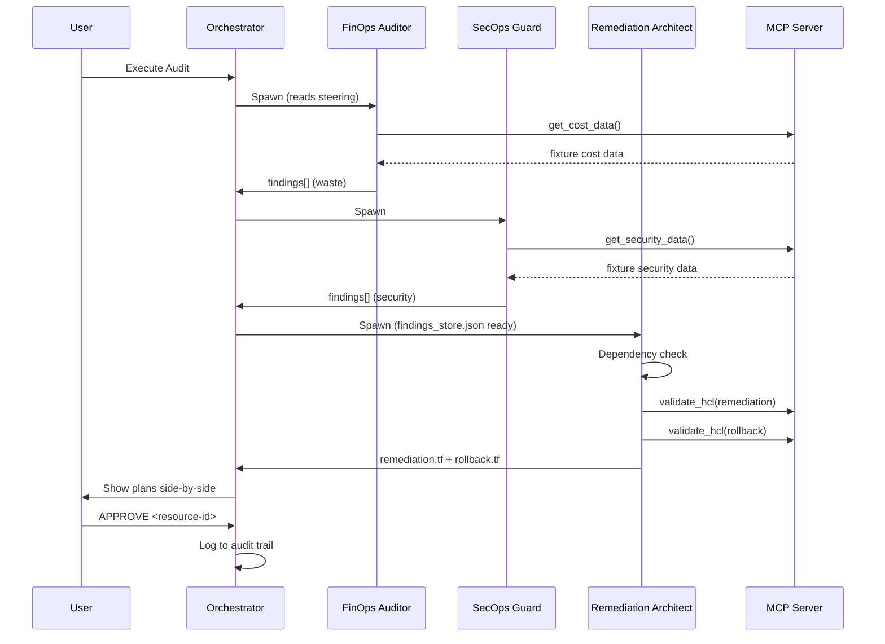

# Cloud Janitor — Design

## Overview

Cloud Janitor is a multi-agent system that detects cloud waste and security vulnerabilities in AWS environments, generates Terraform remediation and rollback plans, and requires explicit human approval before any infrastructure modification. The system uses three specialized agents (FinOps Auditor, SecOps Guard, Remediation Architect) communicating via MCP protocol, orchestrated sequentially to build shared context through a findings store.

The system operates against fixture data (simulated AWS infrastructure) to demonstrate the reasoning architecture without requiring live credentials. All generated infrastructure code includes mandatory tags, passes `terraform validate`, and is accompanied by rollback artifacts.

## Architecture

The system has four layers: Spec Engine, Agent Orchestration, MCP Transport, and Fixture Infrastructure.

```
User
  │ triggers audit
  ▼
Streamlit Dashboard (app.py)
  │ dispatches to orchestrator
  ▼
Agent Orchestrator (orchestrator.py)
  │ reads .kiro/steering/ before spawning agents
  │ enforces sequencing: FinOps → SecOps → Remediation
  │
  ├── FinOps Auditor ──────────────────────┐
  │     calls: mcp.get_cost_data()         │
  │     produces: findings[] severity=waste│
  │                                        ▼
  ├── SecOps Guard ──────────────────────▶ findings_store.json
  │     calls: mcp.get_security_data()     ▲
  │     produces: findings[] severity=sec  │
  │                                        │
  └── Remediation Architect ───────────────┘
        reads: findings_store.json
        calls: mcp.validate_hcl()
        produces: remediation.tf + rollback.tf
        writes: rollbacks/<resource_id>.tf

MCP Layer (mcp_server/aws_janitor_mcp.py)
  ├── get_cost_data(resource_type, min_idle_days)
  │     → reads fixtures/aws_cost_explorer.json
  ├── get_security_data(check_type)
  │     → reads fixtures/aws_config_inspector.json
  └── validate_hcl(hcl_string)
        → shells out to: terraform validate

Hooks (hooks/)
  ├── pre-remediation.sh
  │     trigger: before Remediation Architect writes output
  │     action: terraform validate on generated HCL
  │     blocks execution if validate fails
  └── post-remediation.sh
        trigger: after approved remediation runs
        action: appends to audit.log
```

### Data Flow

1. User clicks "Execute Audit"
2. Orchestrator reads `.kiro/steering/AGENTS.md` to load agent configs
3. FinOps Auditor calls `mcp.get_cost_data()` → parses fixture → produces findings
4. SecOps Guard calls `mcp.get_security_data()` → parses fixture → appends findings
5. findings_store.json written
6. Remediation Architect reads findings, runs dependency check, generates HCL
7. `pre-remediation` hook fires → terraform validate
8. UI shows diff + rollback side-by-side
9. User types "APPROVE \<resource-id\>"
10. Terraform executes (against fixture/mock provider)
11. `post-remediation` hook fires → audit.log written
12. Rollback artifact saved to rollbacks/\<id\>.tf

### Agent Sequencing



## Components and Interfaces

### Streamlit Dashboard (`app.py`)

- Entry point for user interaction
- Displays findings, remediation plans, and rollback plans side-by-side
- Captures typed approval/rollback commands
- Shows audit trail

### Agent Orchestrator (`orchestrator.py`)

- Reads `.kiro/steering/AGENTS.md` for agent configuration
- Enforces strict sequential execution: FinOps → SecOps → Remediation
- Validates that `findings_store.json` contains entries from both prior agents before spawning Remediation Architect
- Manages approval gate protocol

**Interface:**

```python
class Orchestrator:
    def execute_audit() -> AuditResult
    def approve(command: str) -> ApprovalResult
    def rollback(command: str) -> RollbackResult
    def get_audit_trail() -> list[AuditEntry]
```

### FinOps Auditor

- Calls `mcp.get_cost_data(resource_type, min_idle_days)`
- Filters resources by idle duration (flag at 7+ days, remediate at 30+)
- Estimates monthly cost using Cost Explorer fixture data
- Tags each finding with severity: LOW / MEDIUM / HIGH

**Interface:**

```python
class FinOpsAuditor:
    def scan() -> list[Finding]
    def classify_severity(resource: Resource) -> Severity
    def estimate_cost(resource: Resource) -> float
```

### SecOps Guard

- Calls `mcp.get_security_data(check_type)`
- Detects open security groups (0.0.0.0/0 on sensitive ports)
- Audits encryption at rest (ElastiCache, EBS)
- Tags findings: HIGH / CRITICAL with port and CVE references

**Interface:**

```python
class SecOpsGuard:
    def scan() -> list[Finding]
    def check_security_groups() -> list[Finding]
    def check_encryption(resource_type: str) -> list[Finding]
```

### Remediation Architect

- Reads complete `findings_store.json`
- Runs dependency check before any HCL generation
- Produces: dependency report → remediation HCL → rollback HCL (in order)
- All generated resources include required tags

**Interface:**

```python
class RemediationArchitect:
    def check_dependencies(finding: Finding) -> DependencyReport
    def generate_remediation(finding: Finding) -> str  # HCL
    def generate_rollback(finding: Finding) -> str  # HCL
    def plan(findings: list[Finding]) -> RemediationPlan
```

### MCP Server (`mcp_server/aws_janitor_mcp.py`)

- Implements MCP protocol for agent-to-infrastructure communication
- Wraps fixture data behind a genuine MCP interface

**Tools exposed:**

```python
@mcp_tool
def get_cost_data(resource_type: str, min_idle_days: int) -> CostData

@mcp_tool
def get_security_data(check_type: str) -> SecurityData

@mcp_tool
def validate_hcl(hcl_string: str) -> ValidationResult
```

### Hooks

| Hook | Trigger | Action | Blocking |
|------|---------|--------|----------|
| `pre-remediation.sh` | Before Remediation Architect writes output | `terraform validate` on generated HCL | Yes — blocks if validate fails |
| `post-remediation.sh` | After approved remediation runs | Appends entry to `audit.log` | No |

## Data Models

### Finding (findings_store.json entry)

```json
{
  "id": "finding-uuid",
  "resource_id": "aws-resource-identifier",
  "resource_type": "elasticache | ebs | security_group",
  "agent": "finops | secops",
  "category": "waste | security",
  "severity": "LOW | MEDIUM | HIGH | CRITICAL",
  "title": "Human-readable finding title",
  "description": "Detailed explanation of the issue",
  "cost_estimate_monthly": 45.60,
  "idle_days": 42,
  "metadata": {
    "port": 6379,
    "cidr": "0.0.0.0/0",
    "encryption_at_rest": false,
    "current_state": "unencrypted",
    "required_state": "encrypted"
  },
  "detected_at": "2025-01-15T10:30:00Z"
}
```

### findings_store.json (top-level schema)

```json
{
  "scan_id": "uuid",
  "started_at": "ISO-8601 timestamp",
  "completed_at": "ISO-8601 timestamp",
  "findings": [Finding, ...],
  "summary": {
    "total": 5,
    "by_severity": {"LOW": 0, "MEDIUM": 2, "HIGH": 2, "CRITICAL": 1},
    "by_agent": {"finops": 3, "secops": 2},
    "total_monthly_waste": 234.50
  }
}
```

### Remediation HCL Structure

```hcl
# Example: EBS volume remediation
resource "aws_ebs_snapshot" "pre_remediation_vol_123" {
  volume_id   = "vol-123"
  description = "Pre-remediation snapshot"

  tags = {
    ManagedBy    = "Kiro-Janitor"
    Environment  = var.environment
    RemediatedAt = timestamp()
    RollbackRef  = "rollbacks/vol-123.tf"
  }
}

# Example: Security Group remediation
resource "aws_security_group_rule" "restrict_sg_456_port_22" {
  type              = "ingress"
  from_port         = 22
  to_port           = 22
  protocol          = "tcp"
  cidr_blocks       = [data.aws_vpc.current.cidr_block]
  security_group_id = "sg-456"
}
```

### Rollback HCL Structure

```hcl
# Example: EBS volume rollback
resource "aws_ebs_volume" "restore_vol_123" {
  availability_zone = "us-east-1a"
  snapshot_id       = aws_ebs_snapshot.pre_remediation_vol_123.id

  tags = {
    ManagedBy    = "Kiro-Janitor"
    Environment  = var.environment
    RemediatedAt = timestamp()
    RollbackRef  = "rollbacks/vol-123.tf"
  }
}

# Example: Security Group rollback
resource "aws_security_group_rule" "restore_sg_456_port_22" {
  type              = "ingress"
  from_port         = 22
  to_port           = 22
  protocol          = "tcp"
  cidr_blocks       = ["0.0.0.0/0"]
  security_group_id = "sg-456"
}
```

### Audit Log Entry

```json
{
  "timestamp": "2025-01-15T11:00:00Z",
  "action": "scan | plan | approval | execution | rollback",
  "resource_id": "vol-123",
  "actor": "user@example.com",
  "result": "success | failure | blocked",
  "details": "Optional human-readable context"
}
```

### Dependency Report

```json
{
  "resource_id": "vol-123",
  "has_dependencies": false,
  "dependencies": [],
  "recommendation": "proceed | manual_review",
  "checked_at": "2025-01-15T10:45:00Z"
}
```

## Correctness Properties

*A property is a characteristic or behavior that should hold true across all valid executions of a system — essentially, a formal statement about what the system should do. Properties serve as the bridge between human-readable specifications and machine-verifiable correctness guarantees.*

### Property 1: Idle resource filtering correctness

*For any* set of resources with varying idle durations, the FinOps Auditor SHALL include in its findings only those resources that have been idle for more than 30 days, and SHALL exclude all resources with idle duration ≤ 30 days.

**Validates: Requirements 1.1, 1.2**

### Property 2: Findings structural completeness

*For any* finding produced by any agent, the finding SHALL contain all required fields: id, resource_id, resource_type, severity, cost_estimate_monthly (for FinOps findings), and type-specific metadata fields (port/cidr for security findings, current_state/required_state for encryption findings).

**Validates: Requirements 1.3, 2.1, 3.2, 4.3**

### Property 3: Severity classification correctness

*For any* finding, the severity SHALL be correctly assigned according to the classification rules: ElastiCache idle > 30d = HIGH, unattached EBS > 30d = MEDIUM, open security group on database/cache ports (3306, 5432, 6379, 27017) = CRITICAL, open security group on SSH (22) = HIGH.

**Validates: Requirements 2.2, 2.3, 3.3**

### Property 4: Security group open-port detection

*For any* security group configuration, the SecOps Guard SHALL flag it if and only if it contains an ingress rule with CIDR 0.0.0.0/0 on a sensitive port (22, 3306, 5432, 6379, 27017). Security groups without such rules SHALL NOT appear in findings.

**Validates: Requirements 3.1**

### Property 5: Encryption state detection

*For any* ElastiCache cluster or EBS volume, the SecOps Guard SHALL produce a finding if and only if the resource lacks encryption at rest. The finding SHALL accurately report the current encryption state and the required state.

**Validates: Requirements 4.1, 4.2**

### Property 6: Generated HCL validity

*For any* finding that passes dependency check, the Remediation Architect SHALL produce remediation HCL and rollback HCL that both pass `terraform validate`. Additionally, all generated resource blocks SHALL contain the required tags (ManagedBy, Environment, RemediatedAt, RollbackRef).

**Validates: Requirements 5.4**

### Property 7: Dependency gating

*For any* finding, the system SHALL block remediation HCL generation if and only if the dependency check identifies existing dependencies. Findings with no dependencies SHALL proceed to HCL generation; findings with dependencies SHALL produce a blocking warning.

**Validates: Requirements 6.2, 6.3**

### Property 8: Command string validation

*For any* input string and resource ID, the approval system SHALL accept the string if and only if it exactly matches the expected format ("APPROVE \<resource-id\>" for approval, "ROLLBACK \<resource-id\>" for rollback initiation, "CONFIRM ROLLBACK \<resource-id\>" for rollback confirmation). All other strings SHALL be rejected.

**Validates: Requirements 7.1, 8.1, 8.3**

### Property 9: Audit log completeness and immutability

*For any* system action (scan, plan, approval, execution, rollback), the system SHALL produce an audit log entry containing all required fields (timestamp, action, resource_id, actor, result). The audit log length SHALL be monotonically non-decreasing — no entries are ever removed.

**Validates: Requirements 7.3, 8.4, 9.1, 9.2, 9.3**

## Error Handling

Error handling follows the rules defined in the Infrastructure Remediation Standards:

### Dependency Conflicts

- **Trigger:** Dependency check finds resources that depend on the target
- **Response:** Surface warning to user, block remediation, suggest manual review
- **Recovery:** User must manually resolve dependency before re-attempting

### Terraform Validation Failures

- **Trigger:** `terraform validate` fails on generated remediation or rollback HCL
- **Response:** Surface the full error text to the user, block the approval prompt from appearing
- **Recovery:** Remediation Architect regenerates HCL addressing the validation error

### Approval String Mismatch

- **Trigger:** User input does not exactly match "APPROVE \<resource-id\>"
- **Response:** Display expected format, re-prompt the user
- **Retry limit:** Maximum 3 attempts before aborting the approval flow
- **Recovery:** User must re-initiate the approval process

### Missing Rollback Artifact

- **Trigger:** Rollback is requested but `rollbacks/<resource_id>.tf` does not exist
- **Response:** Surface error to user, do not proceed with rollback
- **Recovery:** Manual intervention required — user must locate or regenerate rollback HCL

### MCP Server Errors

- **Trigger:** MCP tool call fails (fixture file missing, malformed JSON, terraform binary not found)
- **Response:** Agent reports failure to orchestrator, orchestrator surfaces error to dashboard
- **Recovery:** Fix fixture data or system configuration, re-run audit

### Agent Sequencing Violations

- **Trigger:** An agent attempts to run before its predecessor has completed
- **Response:** Orchestrator blocks the agent, logs sequencing violation
- **Recovery:** Automatic — orchestrator waits for predecessor to complete

## Testing Strategy

### Unit Tests

Unit tests cover specific examples and edge cases:

- **FinOps Auditor:** Test with fixture data containing a mix of idle/active resources at boundary values (exactly 7 days, exactly 30 days, 31 days)
- **SecOps Guard:** Test with security groups containing various CIDR/port combinations including edge cases (port 0, port 65535, mixed rules)
- **Remediation Architect:** Test dependency check with known dependency graphs, verify HCL output contains required tags
- **Command validation:** Test exact match acceptance and rejection of common typos, case variations, extra whitespace
- **Audit logging:** Test that each action type produces a complete log entry

### Property-Based Tests

Property-based tests validate the correctness properties defined above using `hypothesis` (Python). Each property test runs a minimum of 100 iterations.

| Property | Generator Strategy | What varies |
|----------|-------------------|-------------|
| P1: Idle filtering | Random resources with idle_days ∈ [0, 365] | Duration values, resource counts |
| P2: Structural completeness | Random valid findings from all agents | Resource types, metadata shapes |
| P3: Severity classification | Random findings across all resource types and conditions | Resource type × condition combinations |
| P4: Open-port detection | Random SG configs with various CIDR/port pairs | Port numbers, CIDR blocks, rule counts |
| P5: Encryption detection | Random resources with encryption on/off | Resource types, encryption states |
| P6: HCL validity | Random findings → generated HCL | Finding types, resource IDs, metadata |
| P7: Dependency gating | Random findings with/without dependencies | Dependency graph shapes |
| P8: Command validation | Random strings + valid resource IDs | String content, whitespace, casing |
| P9: Audit immutability | Random action sequences | Action types, ordering, volume |

**Configuration:**

- Library: `hypothesis` (Python)
- Minimum iterations: 100 per property
- Tag format: `# Feature: cloud-janitor, Property {N}: {title}`

### Integration Tests

Integration tests verify end-to-end workflow with fixture data:

- Full audit flow: FinOps → SecOps → Remediation with known fixture data
- Approval gate: verify no execution without typed approval
- Rollback flow: verify rollback plan shown before execution
- Hook execution: verify `pre-remediation.sh` blocks on invalid HCL
- Audit trail: verify all actions are logged in correct order

## Key Design Decisions

**Why simulated infrastructure?**
Live AWS requires credentials, introduces demo risk, and is unnecessary to demonstrate the reasoning architecture. Judges care about the agent logic, MCP integration, and spec workflow — not whether real EC2 instances exist. Simulated data is stated explicitly in the demo.

**Why a custom MCP server instead of off-the-shelf?**
Per judging criteria, building a custom MCP server is a "strong signal of depth" for the Best Kiro Power User award. Our MCP server wraps the fixture data behind a real MCP protocol interface, making the integration architecture genuine even with seeded data.

**Why sequential agents instead of parallel?**
SecOps findings can affect remediation scope (e.g. an idle cluster that's also publicly exposed needs a different remediation plan than one that's just idle). Sequential execution with shared findings_store ensures Remediation Architect has complete context.

**Why typed approval instead of a button?**
Typed confirmation ("APPROVE cache-prod-legacy") creates friction that is intentional — it forces the engineer to name the specific resource they're authorising. A button click is too easy to misfire on a production system.
