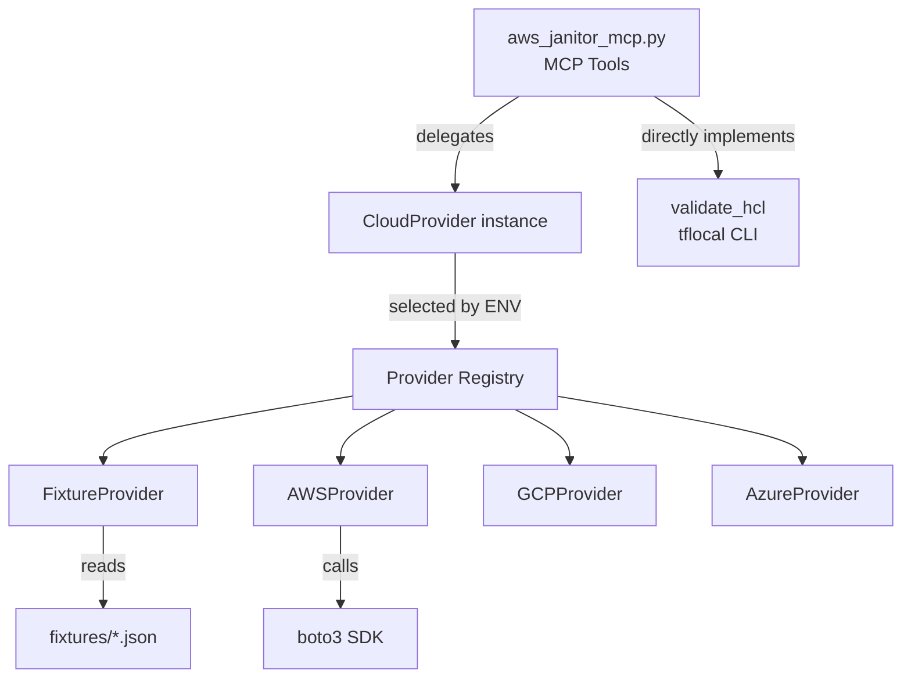
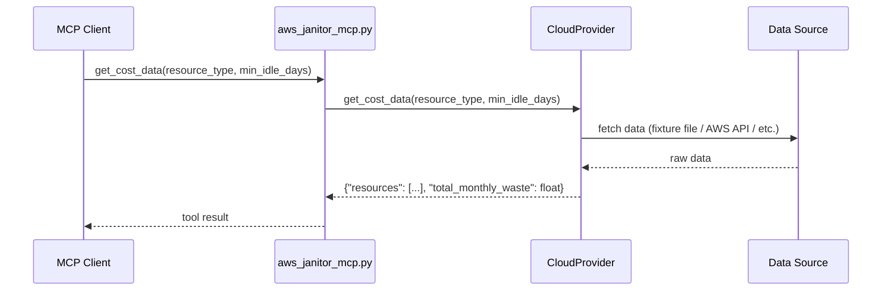
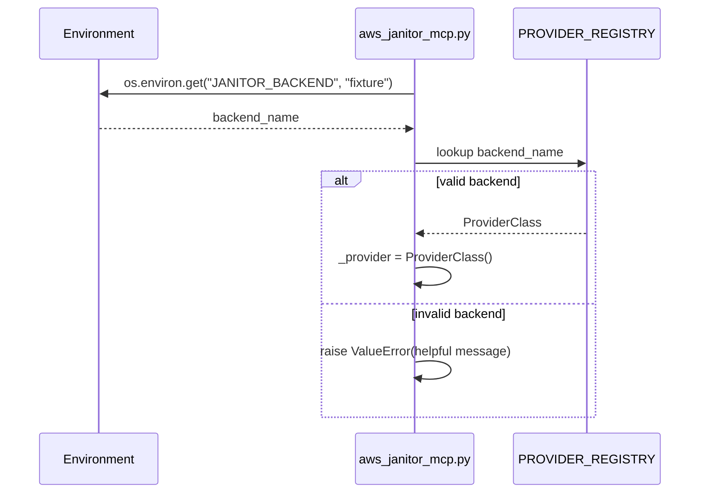

# Design Document: Provider-Agnostic Backend

## Overview

This refactoring introduces a pluggable provider interface to the MCP server, decoupling cloud data retrieval from MCP tool definitions. The existing hardcoded fixture-reading logic moves into a `FixtureProvider` class, and new provider stubs (AWS, GCP, Azure) are added behind a common `CloudProvider` abstract base class. Backend selection happens via the `JANITOR_BACKEND` environment variable at module load time, defaulting to `"fixture"` for full backward compatibility.

The MCP tool signatures (`get_cost_data`, `get_security_data`, `check_dependencies`) remain unchanged. `validate_hcl` stays in the MCP server directly since it uses `tflocal` CLI and is inherently provider-agnostic.

## Architecture



## Sequence Diagrams

### Tool Invocation Flow



### Module Load / Provider Selection



## Components and Interfaces

### Component 1: CloudProvider (Abstract Base Class)

**Purpose**: Defines the contract all cloud backends must implement.

**Interface**:

```python
from abc import ABC, abstractmethod
from typing import Optional


class CloudProvider(ABC):
    """Abstract base class for cloud data providers."""

    @abstractmethod
    def get_cost_data(self, resource_type: Optional[str] = None, min_idle_days: int = 7) -> dict:
        """
        Return idle/orphaned resource data.

        Args:
            resource_type: Filter by type (elasticache|ebs|ec2). None = all.
            min_idle_days: Minimum idle days threshold.

        Returns:
            {"resources": [...], "total_monthly_waste": float}
        """
        ...

    @abstractmethod
    def get_security_data(self, check_type: Optional[str] = None) -> dict:
        """
        Return security findings.

        Args:
            check_type: Filter (security_group|encryption|public_access). None = all.

        Returns:
            {"findings": [...], "critical_count": int}
        """
        ...

    @abstractmethod
    def check_dependencies(self, resource_id: str) -> dict:
        """
        Check resource dependency graph.

        Args:
            resource_id: Cloud resource ID to check.

        Returns:
            {"has_dependencies": bool, "dependents": [...]}
        """
        ...
```

**Responsibilities**:

- Define the method contract for all providers
- Provide type hints and docstrings as the single source of truth for return schemas

### Component 2: FixtureProvider

**Purpose**: Preserves existing behavior by reading from local JSON fixture files.

**Interface**:

```python
class FixtureProvider(CloudProvider):
    """Provider that reads from local JSON fixture files."""

    def __init__(self, fixtures_dir: Path | None = None):
        """
        Args:
            fixtures_dir: Path to fixtures directory. Defaults to project_root/fixtures/.
        """
        ...

    def get_cost_data(self, resource_type: Optional[str] = None, min_idle_days: int = 7) -> dict:
        ...

    def get_security_data(self, check_type: Optional[str] = None) -> dict:
        ...

    def check_dependencies(self, resource_id: str) -> dict:
        ...
```

**Responsibilities**:

- Read `aws_cost_explorer.json` and `aws_config_inspector.json`
- Filter resources by type and idle days
- Filter findings by check type
- Look up dependencies from the `dependencies` map
- Return error dict if fixture file is missing (preserves current behavior)

### Component 3: AWSProvider

**Purpose**: Stub for live AWS API calls via boto3.

**Interface**:

```python
class AWSProvider(CloudProvider):
    """Provider that uses boto3 to query live AWS infrastructure."""

    def __init__(self, region: str | None = None):
        """
        Args:
            region: AWS region. Defaults to boto3 default region resolution.
        """
        ...

    def get_cost_data(self, resource_type: Optional[str] = None, min_idle_days: int = 7) -> dict:
        ...  # raises NotImplementedError

    def get_security_data(self, check_type: Optional[str] = None) -> dict:
        ...  # raises NotImplementedError

    def check_dependencies(self, resource_id: str) -> dict:
        ...  # raises NotImplementedError
```

**Responsibilities**:

- Document required IAM permissions in docstrings
- Raise `NotImplementedError` with descriptive message for each method
- Import boto3 lazily (only when this provider is instantiated)

### Component 4: GCPProvider / AzureProvider

**Purpose**: Minimal stubs for future cloud providers.

```python
class GCPProvider(CloudProvider):
    """Stub provider for Google Cloud Platform. Not yet implemented."""
    ...  # all methods raise NotImplementedError

class AzureProvider(CloudProvider):
    """Stub provider for Microsoft Azure. Not yet implemented."""
    ...  # all methods raise NotImplementedError
```

### Component 5: Provider Registry and Selection (in aws_janitor_mcp.py)

**Purpose**: Maps backend names to provider classes and instantiates the active provider.

```python
from mcp_server.backends import FixtureProvider, AWSProvider, GCPProvider, AzureProvider

PROVIDER_REGISTRY: dict[str, type[CloudProvider]] = {
    "fixture": FixtureProvider,
    "aws": AWSProvider,
    "gcp": GCPProvider,
    "azure": AzureProvider,
}


def _load_provider() -> CloudProvider:
    """Instantiate the provider based on JANITOR_BACKEND env var."""
    backend = os.environ.get("JANITOR_BACKEND", "fixture")
    if backend not in PROVIDER_REGISTRY:
        valid = ", ".join(sorted(PROVIDER_REGISTRY.keys()))
        raise ValueError(
            f"Invalid JANITOR_BACKEND={backend!r}. Valid options: {valid}"
        )
    return PROVIDER_REGISTRY[backend]()


_provider: CloudProvider = _load_provider()
```

## Data Models

> **⚠️ IMPORTANT**: The TypedDicts below are *illustrative only* and describe an idealized schema.
> Do NOT use them for runtime validation or as the basis for fixture parsing.
> The actual fixture schemas are:
>
> - `aws_cost_explorer.json` resources: `resource_id`, `type`, `name`, `idle_days`, `monthly_cost`, `status` (varies by resource type)
> - `findings_store.json` findings: `id`, `resource_id`, `resource_type`, `agent`, `category`, `severity`, `title`, `description`, `cost_estimate_monthly`, `idle_days`, `metadata`, `detected_at`
>
> The FixtureProvider must parse the **actual fixture fields**, not these TypedDict fields.
> The provider passes through whatever the JSON contains — no schema enforcement at runtime.

### Cost Data Response (illustrative)

```python
from typing import TypedDict


class CostResource(TypedDict):
    id: str
    type: str  # "elasticache" | "ebs" | "ec2"
    name: str
    idle_days: int
    monthly_cost: float
    status: str
    description: str
    availability_zone: str
    created_at: str


class CostDataResponse(TypedDict):
    resources: list[CostResource]
    total_monthly_waste: float
```

### Security Data Response (illustrative)

```python
class SecurityFinding(TypedDict):
    id: str
    resource_id: str
    resource_type: str
    check_type: str  # "security_group" | "encryption" | "public_access"
    severity: str  # "CRITICAL" | "HIGH" | "MEDIUM" | "LOW"
    current_state: str
    required_state: str
    title: str
    description: str


class SecurityDataResponse(TypedDict):
    findings: list[SecurityFinding]
    critical_count: int
```

### Dependency Check Response

```python
class DependencyResponse(TypedDict):
    has_dependencies: bool
    dependents: list[str]
```

**Validation Rules**:

- `total_monthly_waste` is rounded to 2 decimal places
- `critical_count` equals the count of findings with `severity == "CRITICAL"`
- `has_dependencies` is `True` if and only if `len(dependents) > 0`

## Key Functions with Formal Specifications

### Function: `_load_provider()`

```python
def _load_provider() -> CloudProvider:
    ...
```

**Preconditions:**

- `PROVIDER_REGISTRY` is populated with at least the `"fixture"` key
- `os.environ` is accessible

**Postconditions:**

- If `JANITOR_BACKEND` is unset or `"fixture"`, returns a `FixtureProvider` instance
- If `JANITOR_BACKEND` is a valid key, returns the corresponding provider instance
- If `JANITOR_BACKEND` is invalid, raises `ValueError` with message listing valid options

### Function: `FixtureProvider.get_cost_data()`

```python
def get_cost_data(self, resource_type: Optional[str] = None, min_idle_days: int = 7) -> dict:
    ...
```

**Preconditions:**

- `self._fixtures_dir` points to an existing directory (or graceful error)
- `resource_type` is `None` or one of `"elasticache"`, `"ebs"`, `"ec2"`
- `min_idle_days >= 0`

**Postconditions:**

- If fixture file missing: returns `{"error": ..., "resources": [], "total_monthly_waste": 0.0}`
- Otherwise: `resources` contains only items matching both filters
- `total_monthly_waste == round(sum(r["monthly_cost"] for r in resources), 2)`

### Function: `FixtureProvider.get_security_data()`

```python
def get_security_data(self, check_type: Optional[str] = None) -> dict:
    ...
```

**Preconditions:**

- `check_type` is `None` or one of `"security_group"`, `"encryption"`, `"public_access"`

**Postconditions:**

- If fixture file missing: returns `{"error": ..., "findings": [], "critical_count": 0}`
- Otherwise: `findings` contains only items matching `check_type` filter (or all if `None`)
- `critical_count == sum(1 for f in findings if f["severity"] == "CRITICAL")`

### Function: `FixtureProvider.check_dependencies()`

```python
def check_dependencies(self, resource_id: str) -> dict:
    ...
```

**Preconditions:**

- `resource_id` is a non-empty string

**Postconditions:**

- If fixture file missing: returns `{"error": ..., "has_dependencies": False, "dependents": []}`
- Otherwise: `dependents` is the list from `data["dependencies"].get(resource_id, [])`
- `has_dependencies == (len(dependents) > 0)`

## Example Usage

```python
import os

# Default: fixture backend (backward compatible)
os.environ["JANITOR_BACKEND"] = "fixture"
from mcp_server.aws_janitor_mcp import _provider

result = _provider.get_cost_data(resource_type="ebs", min_idle_days=30)
# {"resources": [...], "total_monthly_waste": 12.50}

result = _provider.get_security_data(check_type="security_group")
# {"findings": [...], "critical_count": 2}

result = _provider.check_dependencies("sg-prod-redis")
# {"has_dependencies": True, "dependents": ["cache-prod-legacy-01"]}


# AWS backend: starts but methods raise NotImplementedError
os.environ["JANITOR_BACKEND"] = "aws"
# provider = AWSProvider()
# provider.get_cost_data()  # raises NotImplementedError


# Invalid backend: raises immediately
os.environ["JANITOR_BACKEND"] = "invalid"
# _load_provider()  # raises ValueError("Invalid JANITOR_BACKEND='invalid'. Valid options: aws, azure, fixture, gcp")
```

## Error Handling

### Error Scenario 1: Invalid Backend Name

**Condition**: `JANITOR_BACKEND` env var set to unrecognized value
**Response**: `ValueError` raised at module load time with message listing valid options
**Recovery**: User corrects the environment variable and restarts

### Error Scenario 2: Missing Fixture File

**Condition**: Fixture JSON file doesn't exist on disk
**Response**: Return error dict with `"error"` key and empty/zero defaults for other fields
**Recovery**: User creates the missing fixture file; no restart needed (files read per invocation)

### Error Scenario 3: Unimplemented Provider Method

**Condition**: Calling a method on `AWSProvider`, `GCPProvider`, or `AzureProvider`
**Response**: `NotImplementedError` raised with message describing which provider/method is not yet implemented
**Recovery**: User switches to `fixture` backend or implements the method

### Error Scenario 4: boto3 Not Installed

**Condition**: `JANITOR_BACKEND=aws` but boto3 not in environment
**Response**: `ImportError` raised at provider instantiation with helpful install message
**Recovery**: User runs `pip install boto3>=1.34.0`

## Testing Strategy

### Unit Testing Approach

- Test `FixtureProvider` methods directly with known fixture data
- Test `_load_provider()` with mocked env vars for each valid backend and invalid values
- Test that `AWSProvider`/`GCPProvider`/`AzureProvider` raise `NotImplementedError`
- Test backward compatibility: existing tests pass without modification when `JANITOR_BACKEND` is unset

### Property-Based Testing Approach

- Use `hypothesis` (already in requirements.txt)
- Generate random resource types, idle days, check types, and resource IDs
- Verify structural invariants of provider responses

**Property Test Library**: hypothesis

### Integration Testing Approach

- Verify MCP tool signatures haven't changed by calling tools through FastMCP test client
- Verify fixture backend produces identical results to original inline implementation
- Verify env var selection works end-to-end

## Dependencies

- `mcp>=1.28.1` — FastMCP for MCP server (existing)
- `boto3>=1.34.0` — AWS SDK, optional, only imported when `JANITOR_BACKEND=aws`
- `hypothesis>=6.100.0` — Property-based testing (existing, dev dependency)
- `pytest>=8.0.0` — Test runner (existing, dev dependency)

## Correctness Properties

*A property is a characteristic or behavior that should hold true across all valid executions of a system — essentially, a formal statement about what the system should do. Properties serve as the bridge between human-readable specifications and machine-verifiable correctness guarantees.*

### Property 1: Fixture backend behavioral equivalence

*For any* valid combination of `resource_type` and `min_idle_days`, the `FixtureProvider.get_cost_data()` output must be identical to the output that the original inline implementation in `aws_janitor_mcp.py` would produce given the same fixture data.

**Validates: Requirements 8.1, 8.3**

### Property 2: Cost data structural invariants

*For any* call to `get_cost_data()` on the FixtureProvider, the result must contain a `"resources"` list and a `"total_monthly_waste"` float where `total_monthly_waste == round(sum(r["monthly_cost"] for r in resources), 2)`, and all returned resources must satisfy both the `resource_type` filter (if provided) and `idle_days >= min_idle_days`.

**Validates: Requirements 2.2, 2.3, 2.4**

### Property 3: Security data critical count consistency

*For any* call to `get_security_data()` on the FixtureProvider, `critical_count` must equal the number of findings in the returned list where `severity == "CRITICAL"`, and all returned findings must match the `check_type` filter (if provided).

**Validates: Requirements 2.6, 2.7**

### Property 4: Dependency response boolean consistency

*For any* call to `check_dependencies()` on the FixtureProvider, `has_dependencies` must be `True` if and only if `len(dependents) > 0`.

**Validates: Requirements 2.8, 2.9**

### Property 5: Provider registry completeness

*For any* valid backend name in the `PROVIDER_REGISTRY`, calling `_load_provider()` with that name in the environment must return an instance of `CloudProvider` (not raise).

**Validates: Requirements 5.3, 5.4**

### Property 6: Invalid backend rejection

*For any* string not in `PROVIDER_REGISTRY` keys, `_load_provider()` must raise `ValueError` containing the invalid name and listing all valid options.

**Validates: Requirements 5.5**
