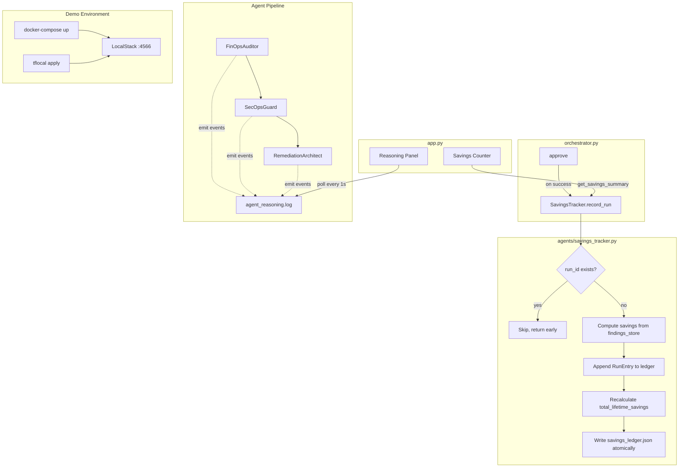

# Design Document: Savings Tracker & LocalStack Integration

## Overview

This design covers four sub-features added to the Cloud Janitor project:

1. **Savings Tracker** (`agents/savings_tracker.py`) — a persistent cumulative savings ledger that records cost savings across multiple audit-and-remediation runs, exposes a summary API, and integrates with the orchestrator's `approve()` method.
2. **LocalStack Wiring** — replaces all `terraform` subprocess calls with `tflocal` (from `terraform-local`) and introduces a `docker-compose.yml` with a LocalStack service for demo-mode execution.
3. **SPEC_COMPLIANCE.md Generator** (`scripts/generate_spec_compliance.py`) — reads `.kiro/specs/tasks.md`, verifies file artifacts exist, and outputs a compliance report. A Git post-commit hook auto-runs it.
4. **Streaming Agent Reasoning Logger** — each agent emits structured JSON events to `output/logs/agent_reasoning.log`, rendered in a Streamlit panel with live polling.

### Design Rationale

- **Recalculate-from-source pattern**: The savings ledger uses `sum(monthly_savings_added for all runs)` instead of incrementally adding to a running total. This means any single corrupted entry self-heals on the next write.
- **Deduplication by non-mutation**: Duplicate `run_id` detection simply returns early without touching the file (mtime unchanged), preventing inflation and making idempotency observable.
- **tflocal over environment variables**: Using `tflocal` (a wrapper CLI from `terraform-local`) is simpler and more reliable than overriding Terraform provider endpoints via environment variables; it handles LocalStack endpoint injection automatically.
- **Fragment-based Streamlit polling**: Using `@st.fragment(run_every=1)` (Streamlit ≥ 1.33) avoids full-page reruns and keeps other dashboard panels stable. The fallback for older Streamlit uses a background thread with session_state flag polling.

## Architecture



## Components and Interfaces

### 1. SavingsTracker (`agents/savings_tracker.py`)

**Location**: `agents/savings_tracker.py`

```python
class SavingsTracker:
    """Manages the savings_ledger.json lifecycle."""

    def __init__(
        self,
        ledger_path: Path | None = None,
        findings_store_path: Path | None = None,
    ): ...

    def record_run(self, resources_remediated: list[str]) -> bool:
        """
        Record a remediation run in the ledger.

        Args:
            resources_remediated: List of resource_id strings that were
                approved and executed.

        Returns:
            True if the run was recorded, False if it was a duplicate.

        Behavior:
            1. Read scan_id and completed_at from findings_store.json
            2. Check if scan_id already exists in ledger runs → skip if duplicate
            3. Compute monthly_savings_added from findings whose resource_id
               is in resources_remediated
            4. Append RunEntry
            5. Recalculate total_lifetime_savings from all runs
            6. Write ledger file
        """
        ...

    def get_savings_summary(self) -> dict:
        """
        Return savings summary.

        Returns:
            {
                "total_lifetime_monthly": float,
                "total_lifetime_annual": float,
                "total_runs": int,
                "last_run_savings": float,
            }
        """
        ...

    def _load_ledger(self) -> dict:
        """Load ledger from disk or return empty structure."""
        ...

    def _write_ledger(self, ledger: dict) -> None:
        """Write ledger to disk."""
        ...

    def _compute_monthly_savings(self, resources_remediated: list[str]) -> float:
        """Sum cost_estimate_monthly for matching findings."""
        ...

    def _recalculate_total(self, runs: list[dict]) -> float:
        """Sum monthly_savings_added across all runs."""
        ...
```

**Integration point in `orchestrator.py`**:

```python
# In Orchestrator.__init__:
from agents.savings_tracker import SavingsTracker
self._savings_tracker = SavingsTracker(...)

# In Orchestrator.approve(), AFTER successful approval and execution:
self._savings_tracker.record_run(resources_remediated=[resource_id])
```

The `record_run` call is placed exclusively in `approve()`, after the `_run_post_remediation_hook` call, to ensure it only fires for genuinely approved and executed remediations.

### 2. Reasoning Logger (`agents/reasoning_logger.py`)

**Location**: `agents/reasoning_logger.py`

```python
class ReasoningLogger:
    """Structured JSON event logger for agent reasoning traces."""

    VALID_EVENT_TYPES = {"check", "finding", "skip", "decision", "handoff"}

    def __init__(self, log_path: Path | None = None): ...

    def truncate(self) -> None:
        """Truncate the log file (called at audit start)."""
        ...

    def emit(self, agent: str, event_type: str, resource_id: str, message: str) -> None:
        """
        Append a structured JSON line to agent_reasoning.log.

        Args:
            agent: Agent name (max 64 chars, truncated if longer)
            event_type: One of VALID_EVENT_TYPES
            resource_id: Resource ID or empty string
            message: Plain-text explanation (max 500 chars, truncated if longer)

        On filesystem error: prints to stderr, does NOT raise.
        """
        ...
```

Each agent receives a `ReasoningLogger` instance and calls `emit()` at key decision points during its `scan()` / `plan()` execution.

### 3. LocalStack Terraform Executor

**Changes to `mcp_server/aws_janitor_mcp.py`**:

```python
# Replace:
#   ["terraform", "init", "-backend=false"]
#   ["terraform", "validate"]
# With:
#   ["tflocal", "init", "-backend=false"]
#   ["tflocal", "validate"]
```

**Changes to `hooks/pre-remediation.sh`**:

```bash
# Replace all occurrences of:
#   terraform -chdir="$tmp_dir" init ...
#   terraform -chdir="$tmp_dir" validate
# With:
#   tflocal -chdir="$tmp_dir" init ...
#   tflocal -chdir="$tmp_dir" validate
```

### 4. Docker Compose (`docker-compose.yml`)

```yaml
version: "3.8"
services:
  localstack:
    image: localstack/localstack:latest
    ports:
      - "4566:4566"
    environment:
      - SERVICES=ec2,elasticache,s3,ebs
      - DEFAULT_REGION=us-east-1
      - DOCKER_HOST=unix:///var/run/docker.sock
    volumes:
      - "/var/run/docker.sock:/var/run/docker.sock"
```

### 5. Makefile (`Makefile`)

**IMPORTANT**: The `make demo` target does NOT call `tflocal apply` directly. The orchestrator already invokes `tflocal` internally when the user approves a remediation via the Streamlit UI. Calling it again from the Makefile would double-apply.

The correct sequence is: start LocalStack → health check → launch Streamlit app. The `tflocal apply` happens inside `orchestrator.py` when the user types `APPROVE <resource-id>`.

```makefile
.PHONY: demo

demo:
 docker-compose up -d
 @echo "Waiting for LocalStack..."
 @i=0; while [ $$i -lt 30 ]; do \
  if curl -s http://localhost:4566/_localstack/health | grep -q '"ready"'; then \
   echo " ready!"; break; \
  fi; \
  printf "."; \
  sleep 2; \
  i=$$((i + 1)); \
 done; \
 if [ $$i -eq 30 ]; then \
  echo "\nERROR: LocalStack failed to start within 60 seconds"; exit 1; \
 fi
 streamlit run app.py
```

### 6. Compliance Generator (`scripts/generate_spec_compliance.py`)

A standalone Python script that:

1. Reads `.kiro/specs/tasks.md`
2. Parses checkbox lines (`- [x]`, `- [ ]`, `- [-]`)
3. For each "done" task, verifies existence of mapped artifact
4. Outputs `SPEC_COMPLIANCE.md` as a 4-column Markdown table: `#`, `Task`, `Status`, `Artifact Verified`

The output format uses the 4-column table shown in the Data Models section below (not a 3-column format).

### 7. Streamlit Reasoning Panel (in `app.py`)

```python
# If Streamlit >= 1.33:
@st.fragment(run_every=1)
def reasoning_log_panel():
    """Poll agent_reasoning.log and render color-coded events."""
    ...

# If Streamlit < 1.33:
# Run audit in background thread, poll from main thread using
# st.empty() + time.sleep(1) checking session_state["audit_running"] flag.
```

## Data Models

### savings_ledger.json Schema

```json
{
  "total_lifetime_savings": 57.6,
  "runs": [
    {
      "run_id": "086a8f10-8e73-44da-91d7-304543f15139",
      "timestamp": "2026-06-27T05:31:48.159990+00:00",
      "resources_remediated": ["cache-prod-legacy-01", "vol-0abc123def456789a"],
      "monthly_savings_added": 57.6,
      "cumulative_at_time": 57.6
    }
  ]
}
```

- `total_lifetime_savings`: Always equals `sum(r["monthly_savings_added"] for r in runs)`. Recalculated on every write.
- `run_id`: Sourced from `findings_store.json` → `scan_id`.
- `timestamp`: Sourced from `findings_store.json` → `completed_at`.
- `cumulative_at_time`: The running total as of this entry (recalculated from source each time).

### agent_reasoning.log Line Schema

```json
{
  "timestamp": "2026-06-27T05:23:37.020107+00:00",
  "agent": "finops_auditor",
  "event_type": "check",
  "resource_id": "cache-prod-legacy-01",
  "message": "Checking ElastiCache cluster idle duration: 42 days exceeds 30-day threshold"
}
```

- One JSON object per line (JSONL format).
- `event_type` ∈ {`check`, `finding`, `skip`, `decision`, `handoff`}.
- `agent` max 64 characters, `message` max 500 characters.
- File is truncated at the start of each new audit run.

### get_savings_summary() Return Schema

```json
{
  "total_lifetime_monthly": 57.6,
  "total_lifetime_annual": 691.2,
  "total_runs": 1,
  "last_run_savings": 57.6
}
```

### SPEC_COMPLIANCE.md Output Format

```markdown
# Spec Compliance Report

Generated: 2026-06-28T12:00:00Z

| # | Task | Status | Artifact Verified |
|---|------|--------|-------------------|
| 1 | Create savings.py module | ✅ Done | savings.py exists |
| 2 | Write design document | ✅ Done | .kiro/specs/design.md exists |
| 3 | Add streaming UI | ❌ Pending | app.py missing expected content |
```

## Correctness Properties

*A property is a characteristic or behavior that should hold true across all valid executions of a system — essentially, a formal statement about what the system should do. Properties serve as the bridge between human-readable specifications and machine-verifiable correctness guarantees.*

### Property 1: RunEntry schema and field correctness

*For any* valid findings_store.json (containing a scan_id, completed_at, and findings with cost_estimate_monthly) and *for any* non-empty list of resources_remediated whose IDs appear in findings, after calling `record_run()`, the appended RunEntry SHALL contain all required keys (`run_id`, `timestamp`, `resources_remediated`, `monthly_savings_added`, `cumulative_at_time`) with `run_id` equal to the findings_store `scan_id` and `timestamp` equal to `completed_at`.

**Validates: Requirements 1.2, 2.1**

### Property 2: Monthly savings computation

*For any* findings_store.json containing N findings with arbitrary `cost_estimate_monthly` values and *for any* subset S of resource IDs from those findings passed to `record_run()`, the resulting RunEntry's `monthly_savings_added` SHALL equal the sum of `cost_estimate_monthly` for exactly those findings whose `resource_id` is in S.

**Validates: Requirements 2.2**

### Property 3: Recalculate-from-source invariant

*For any* sequence of K calls to `record_run()` (each with distinct run_ids), after the K-th write, both `total_lifetime_savings` and the K-th entry's `cumulative_at_time` SHALL equal the sum of `monthly_savings_added` across all K entries in the `runs` array. Neither value shall be computed by incremental addition from a prior stored total.

**Validates: Requirements 2.3, 2.4**

### Property 4: Duplicate run idempotency

*For any* ledger containing one or more RunEntry objects, calling `record_run()` with a `run_id` that already exists in the `runs` array SHALL leave the file completely unmodified — the file's modification time (mtime) SHALL be identical before and after the call, and the `runs` array length SHALL remain unchanged.

**Validates: Requirements 3.1, 3.3**

### Property 5: Savings summary correctness

*For any* ledger state with N ≥ 1 runs, `get_savings_summary()` SHALL return a dictionary where: `total_lifetime_annual` equals `total_lifetime_monthly * 12`, `total_runs` equals the number of entries in the `runs` array, and `last_run_savings` equals the `monthly_savings_added` value of the most recent (last) RunEntry.

**Validates: Requirements 4.1, 4.2, 4.4**

### Property 6: Compliance generator parsing and mapping

*For any* tasks.md file containing lines with `- [x]`, `- [ ]`, or `- [-]` checkbox markers and task descriptions containing any of the defined keywords (e.g., "savings", "FinOps", "remediation"), the compliance generator SHALL correctly identify the checkbox state AND map the task to the correct artifact path according to the keyword-to-file mapping table.

**Validates: Requirements 8.2, 8.3**

### Property 7: Compliance generator output format

*For any* set of parsed tasks (with varying checkbox states and artifact existence results), the compliance generator output SHALL be a valid Markdown table containing columns for task number, task description, status indicator, and artifact verification result.

**Validates: Requirements 8.4**

### Property 8: Reasoning logger emits valid structured JSON

*For any* combination of agent name (string, 0–64 chars), event_type ∈ {check, finding, skip, decision, handoff}, resource_id (string), and message (string, 0–500 chars), calling `emit()` SHALL append exactly one line to the log file that passes `json.loads()` and contains all required keys: `timestamp`, `agent`, `event_type`, `resource_id`, `message`.

**Validates: Requirements 9.4, 9.9**

### Property 9: Reasoning logger sequential append

*For any* sequence of N calls to `emit()` within a single run (after a single `truncate()` call), the log file SHALL contain exactly N lines, and reading them back in order SHALL yield the same sequence of (agent, event_type, resource_id, message) tuples as the input sequence.

**Validates: Requirements 9.6**

### Property 10: Agent section header transitions

*For any* sequence of reasoning log events where the `agent` field changes between consecutive entries, the rendering function SHALL insert a section header containing the new agent name at each transition point. Events with the same agent as their predecessor SHALL NOT produce a section header.

**Validates: Requirements 10.3**

### Property 11: Malformed line resilience

*For any* sequence of lines read from agent_reasoning.log where some lines are valid JSON and others are arbitrary non-JSON strings, the log consumer SHALL yield exactly the set of valid JSON lines (in order) and SHALL NOT raise an exception or halt processing.

**Validates: Requirements 10.6**

## Error Handling

### Savings Tracker Errors

| Scenario | Behavior |
|----------|----------|
| `findings_store.json` missing or unreadable | `record_run()` raises `FileNotFoundError` — caller (orchestrator) handles gracefully, logs warning, does not block approval flow |
| `savings_ledger.json` corrupted (invalid JSON) | `_load_ledger()` returns empty structure `{"total_lifetime_savings": 0.0, "runs": []}`, effectively resetting the ledger |
| Disk full / write permission denied | `_write_ledger()` raises `OSError` — orchestrator logs error to audit trail, approval still succeeds (savings tracking is non-blocking to remediation) |
| `cost_estimate_monthly` missing from a finding | Treated as 0.0 (uses `.get("cost_estimate_monthly", 0.0)`) |

### Reasoning Logger Errors

| Scenario | Behavior |
|----------|----------|
| Cannot open `agent_reasoning.log` for writing | Print error to stderr, continue agent execution without interruption |
| `truncate()` fails (permission denied) | Print error to stderr, continue — events will append to existing content |
| Agent passes message > 500 chars | Truncate to 500 chars silently |
| Agent passes agent name > 64 chars | Truncate to 64 chars silently |
| Invalid event_type passed | Emit with event_type="unknown" or skip — do not crash |

### LocalStack / tflocal Errors

| Scenario | Behavior |
|----------|----------|
| `tflocal` binary not found | `validate_hcl()` returns `{"valid": False, "error": "tflocal not found..."}` |
| `tflocal init` fails | Return error with stderr content, block approval |
| `tflocal validate` fails | Return error with stderr content, block approval |
| `tflocal apply` non-zero exit | Surface stderr as error message, halt pipeline |
| LocalStack not running | `tflocal` commands fail with connection error — surfaced as error |

### Compliance Generator Errors

| Scenario | Behavior |
|----------|----------|
| `.kiro/specs/tasks.md` missing | Exit with error message to stderr, non-zero exit code |
| Artifact path doesn't exist | Mark task as "Pending" in output table (not an error) |
| Output write fails | Raise exception (script fails visibly) |

### Streamlit Reasoning Panel Errors

| Scenario | Behavior |
|----------|----------|
| `agent_reasoning.log` doesn't exist | Show "No reasoning events yet" placeholder |
| Line fails `json.loads()` | Skip silently, continue processing next line |
| Background thread crashes | Set `session_state["audit_running"] = False`, display error in UI |

## Testing Strategy

### Unit Tests (pytest)

Unit tests cover specific examples, edge cases, and integration points:

- **Savings Tracker**: Empty ledger initialization, specific savings computations with known values, error cases (missing files, corrupt JSON)
- **Reasoning Logger**: Specific event emission, truncation behavior, filesystem error handling
- **Compliance Generator**: Known task files with expected outputs, edge cases (empty files, missing artifacts)
- **Orchestrator integration**: Mock SavingsTracker to verify `record_run()` is called from `approve()` and NOT from `_run_post_remediation_hook()`

### Property-Based Tests (Hypothesis)

Property tests verify universal correctness guarantees using the `hypothesis` library (already in requirements.txt):

- **Library**: `hypothesis` (Python)
- **Minimum iterations**: 100 per property test
- **Tag format**: `# Feature: savings-tracker-localstack, Property {N}: {title}`

Each correctness property (1–11) maps to a single Hypothesis test function:

| Property | Test Target | Generator Strategy |
|----------|------------|-------------------|
| 1: RunEntry schema | `SavingsTracker.record_run()` | Random findings dicts + random resource ID subsets |
| 2: Monthly savings computation | `_compute_monthly_savings()` | Random cost floats + random resource ID sets |
| 3: Recalculate-from-source | `record_run()` called K times | Random sequences of 1–10 runs with random costs |
| 4: Duplicate idempotency | `record_run()` with existing ID | Random ledger states + re-invocation |
| 5: Summary correctness | `get_savings_summary()` | Random ledger states with 1–20 runs |
| 6: Parsing and mapping | `parse_tasks()` + `map_artifact()` | Random checkbox lines with keyword combinations |
| 7: Output format | `generate_compliance_table()` | Random task+artifact existence combinations |
| 8: Logger valid JSON | `ReasoningLogger.emit()` | `st.text(alphabet=st.characters(blacklist_categories=('Cs',)))` for message/agent — must cover quotes, backslashes, unicode. NOT just default ASCII. |
| 9: Sequential append | Multiple `emit()` calls | Random sequences of 1–50 events |
| 10: Section headers | `render_events()` | Random event sequences with varying agent names |
| 11: Malformed resilience | Log line parser | Random mix of valid JSON + arbitrary bytes |

### Integration Tests

- **Orchestrator → SavingsTracker wiring**: Verify `approve()` triggers `record_run()` with correct arguments
- **Agent → ReasoningLogger wiring**: Verify each agent emits expected event types during scan/plan
- **LocalStack demo**: End-to-end `make demo` (requires Docker, run in CI only)

### Smoke Tests

- `.gitignore` contains `savings_ledger.json` and `agent_reasoning.log`
- `requirements.txt` contains `terraform-local`
- `docker-compose.yml` defines `localstack` service on port 4566
- `Makefile` contains `demo:` target
- `scripts/generate_spec_compliance.py` exists and runs without error
- No bare `terraform` calls remain in `mcp_server/aws_janitor_mcp.py` or `hooks/pre-remediation.sh`
